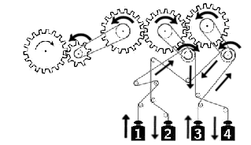

Title: Solucions del Cangur 2016 a Catalunya: Nivell 4t d'ESO
Date: 2016-4-21 12:00
Tags: cangur, matemàtiques
Category: cangur
Status: draft
Slug: solucions-cangur-2016-catalunya-4t-eso
Description: Recull de solucions del nivell de 4t d'ESO de les Proves Cangur 2016 a Catalunya

Ja he preparat el recull de solucions del Nivell de 4t d'ESO del Cangur de Catalunya de 2016. Els enunciats estan extrets del primer model d'examen del [pdf d'enunciats](https://www.lopezferrando.com/cangur/2016_cat/4t_eso/enunciat_2016_cat_4t_eso.pdf){:target="_blank"}.

<!-- PELICAN_END_SUMMARY -->

Si trobeu cap errada o teniu algun comentari o solució alternativa, no dubteu en fer un comentari a sota del tot.

Les solucions estan amagades (cal fer clic per mostrar-les) perquè és recomanable pensar detingudament cada problema abans de mirar la solució que jo proposo!

Podeu accedir a les qüestions directament:

* Qüestions de 3 punts:
  [1](#questio-1), [2](#questio-2), [3](#questio-3), [4](#questio-4),
  [5](#questio-5), [6](#questio-6), [7](#questio-7), [8](#questio-8),
  [9](#questio-9), [10](#questio-10)
* Qüestions de 4 punts:
  [11](#questio-11), [12](#questio-12), [13](#questio-13), [14](#questio-14),
  [15](#questio-15), [16](#questio-16), [17](#questio-17), [18](#questio-18),
  [19](#questio-19), [20](#questio-20)
* Qüestions de 5 punts:
  [21](#questio-21), [22](#questio-22), [23](#questio-23), [24](#questio-24),
  [25](#questio-25), [26](#questio-26), [27](#questio-27), [28](#questio-28),
  [29](#questio-29), [30](#questio-30)

Els enunciats del Cangur són propietat de la Societat Catalana de Matemàtiques i *Le Kangourou sans Frontières*.

### Qüestions de 3 punts

Si traiem els parèntesis ens queda:

$$2016-2015+2014-2013+\cdots+2006-2005=$$
$$=(2016-2015) + (2014-2013) + \cdots + (2006-2005) =$$
$$=1+1+\cdots+1$$

Veiem que cada parella suma $1$, i en total hi ha $6$ parelles, per tant
el resultat és $6$: la solució **A**.

Al quadrat hi ha $5·5=25$ quadradets, de manera que com a molt podrem
posar $6$ figures ($6·4=24$ quadradets). Vegem que podem fer-ho:

Així que la solució és la **B**.

Com ha pagat $95$ €, per tal que la xifra de les unitat siga $5$, ha
d'haver pagat la meitat per uns pantalons amb una xifra de les desenes
senar, és a dir: $50, 70$ o $90$ €. Però el descompte es fa sobre la
peça més barata, així que podem descartar el $90$.

Si ha pagat els pantalons de $50$ € a meitat de preu, n'ha pagat $25$
per aquests pantalons, i per tant, ha comprat també els pantalons
de $95 - 25 = 70$ euros. Així, s'ha estalviat $25$ €: l'opció **D**.

Per una altra banda, si hagués pagat a meitat de preu els pantalons de
$70$ €, hauria d'haver comprat també els pantalons de $95-35=60$ €, però
llavors no se li hauria aplicat el descompte als pantalons que valen $70$ €,
sinó als de $60$ €.

Tenim les següents xifres disponibles:

$$1,2,\ldots,8,9, 10,11,\ldots,18,19$$

Si comptem els cops que tenim cada xifra, tenim:

$$\begin{array}{ccl}
\{0\} & \rightarrow & \text{1 cop} \\
\{1\} & \rightarrow & \text{12 cops} \\
\{2,3,\ldots,9\} & \rightarrow & \text{2 cops}
\end{array}$$

El nombre més gran que podem fer és:

$$99887766554433\;2\;21111111111110$$

Tenim $1+12+2\cdot8=29$ xifres, la d'enmig està en la possició $15$, i és
el $2$. La solució és la **C**.

Denotem la posició inicial com $\text{SJC}$ (Sara, Joana, Clara). A més,
subratllarem les lletres quan ja hagen realitzat un adelantament.
El primer adelantament el poden fer Joana o Clara:

$$\text{SJC} \rightarrow
\{\underline{\text{J}}\text{SC},\; \text{S}\underline{\text{C}}\text{J} \}$$

Ara, en el primer cas poden adelantar tant Sara com Carla, però en el
segon només pot adelantar Joana:

$$\underline{\text{J}}\text{SC} \rightarrow \{
  \underline{\text{S}}\underline{\text{J}}\text{C},\;
  \underline{\text{J}}\underline{\text{C}}\text{S} \}$$

$$\text{S}\underline{\text{C}}\text{J} \rightarrow
\{ \text{S}\underline{\text{J}}\underline{\text{C}} \}$$

De les tres configuracions que ens queden, la tercera la podem descartar,
perquè li toca adelantar a la Sara, però va la primera. Amb les altres
dues, obtenim:

$$\underline{\text{S}}\underline{\text{J}}\text{C} \rightarrow
\underline{\text{S}}\underline{\text{C}}\underline{\text{J}}$$
$$\underline{\text{J}}\underline{\text{C}}\text{S} \rightarrow
\underline{\text{J}}\underline{\text{S}}\underline{\text{C}}$$

Així hem vist que només hi ha dues possibles configuracions finals:
$\underline{\text{SCJ}}$ i $\underline{\text{JSC}}$, i per tant
la solució és la **B**.

La mediana és el valor d'enmig de tots els resultats ordenats. Podem
comprovar a la figura que aquest valor és el $3$, i la solució és la
**B**.

Situant-nos a la base del triangle gran, veiem que el vèrtex esquerre
i el vèrtex dret del triangle puntejat formen la base d'un triangle
equilàter. Aquest triangle equilàter té un costat de $5+2+5=12$, cosa
que deduïm del seu costat dret.

De la mateixa manera, amb el vèrtex dret del triangle gran i el vèrtex
esquerre del triangle puntejat de sota, podem construir un altre
triangle equilàter de costat $12$.

Així, la base del triangle gran mesura $12+12-5=19$, és a dir, la longitud
del costat dels dos triangle equilàters mitjans que hem construït menys
la longitud de la base d'un triangle puntejat, perquè l'hem comptat dos
cops. Així, la solució és la **E**.

Dibuixem les rectes i punts tal com especifica l'enunciat:

En primer lloc, adonem-nos que no és possible crear triangles amb
tres punts de la mateixa recta. Comptarem primer la possibilitat de
triar dos punts de la recta de dalt i un tercer de sota, per després
comptar els triangles amb dos punts a sota i un punt a dalt.

Si triem els dos punts a dalt, és a dir, $A'$ i $B'$, podem triar
com a tercer punt qualsevol dels $4$ de sota.

Si triem dos punts a baix, podem fer-ho de les seqüents formes:
$AB, AC, AD, BC, BD, CD$, és a dir, de $6$ formes diferents. Per cada
parella de punts, a dalt podem triar o bé $A'$ o bé $B'$. De manera
que hi ha $6\cdot2=12$ opcions.

En total, podem formar $4+12=16$ triangles diferents amb aquests sis
punts, i la solució és la **D**.

El quadrat gran té una àrea de $36$, per tant el seu costat mesura
$\sqrt{36}=6$. Els quadrats petits tenen un costat que és una tercera
part d'aquest, per tant, tenen un costat de $\frac63=2$.

Així, l'àrea total de la figura és: $36 + 6\cdot2^2=36+24=60$. Per tant,
el percentatge de la figura ocupat pel triangle gran és:

$$\frac{36}{60}\cdot100=\frac{360}{6}=60 \%$$

I la solució és la **C**.

Hi ha 12 persones que toquen un instrument, $8$ són homes i $4$ són dones.
Com el $60\%$ de les dones no toca cap instrument, això vol dir que el
$40\%$ sí que ho fan, i aquestes són les $4$ dones que hem nombrat abans.
Llavors, en total hi ha $10$ dones (4 que toquen i 6 que no). Finalment,
si hi ha $10$ dones, hi ha $32-10=22$ homes, i la solució és la **B**.

### Qüestions de 4 punts

A cada costat té dues opcions: o bé dibuixar el costat paral·lel per
dins del triangle original, o bé dibuixar-lo per fora. Així, el nombre
de triangles que pot dibuixar és: $2\cdot2\cdot2=8$, i la solució és la
**E**.

La manera òptima de doblegar-lo és per la meitat. Començant pel costat
llarg, si el dobleguem un cop mesurarà $2,20:2=1,10 \text{ m}$,
i com segueix sent
massa llarg, el tornem a doblegar: $1,10:2=0,55\text{ m}$.
Ara ja cabria al costat llarg del calaix.

Dobleguem doncs el costat petit: fent-ho un cop, mesura
$1,40:2=0,70\text{ m}$. Com és massa llarg, el tornem a doblegar:
$0,70:2=0,35\text{ m}$. Ara cap al cosat curt del calaix, i per tant
el llençol cap del tot!

L'hem hagut de doblegar $4$ cops, i per tant la solució és la **C**.

Anomenem $a$ el nombre d'abonats, de manera que $200-a$ és el nombre
de no abonats. Avui han anat $a$ abonats, i el $25\%$ dels
no abonats, és a dir, una quarta part: $\frac14\cdot(200-a)$.
En total, s'ha recaptat:

$$10\cdot a + 40\cdot\frac14\cdot(200-a) = 10a + 2000 - 10a = 2000$$

I la solució és la **D**.

Si seguim els moviment de les rodes dentades i les cordes, podem deduir
tots els moviments:

I cap amunt van els pesos $1$ i $3$, la solució **A**.

La única figura que no cap és la **E**. Per tal de tenir una àrea igual a la
del quadrat, el triangle equilàter haurà de sobresortir, com veiem a la figura:

La resta d'opcions caben dins del quadrat:

Anomenem $x$ el nombre de bales que tenen les deu noies al principi.
Si la mitjana disminueix en una, això vol dir que:

$$\frac{x}{10} = \frac{x+1}{11} + 1$$

Si operem aquesta igualtat, tenim:

$$\frac{x}{10} = \frac{x+12}{11} \quad \Rightarrow \quad
11x = 10x+120 \quad \Rightarrow \quad x = 120$$

Llavors, entre les onze tenen $120+1=121$ bales, i la solució és la **D**.

L'àrea enfosquida resulta de treure-li al quadrat gran l'àrea
del quadrat petit (de costat $3x$) i dels dos triangles rectangles blancs.
De fet, la suma dels dos triangles rectangles és un rectangle de costats
$x$ i $4x$. Llavors, l'àrea ombrejada és:

$$(4x)^2 - (3x)^2 - 4x\cdot x = 16x^2 - 9x^2 - 4x^2 = 3x^2$$

I la solució és la **A**.

Començant pel vèrtex de dalt a l'esquerra, podem triar qualsevol dels
$3$ colors.

Seguidament, triarem els dos vèrtexs adjacents al primer (dalt a la
dreta i baix a l'esquerra). Per cadascun d'aquests dos podem triar
qualsevol dels dos colors diferents al primer. En total hi ha quatre
opcions: en dues els dos colors triats són els mateixos, i en les altres
dues són diferents.

Si els colors triats són diferents, l'últim vèrtex només pot tindre una
opció. Si els colors són iguals, a l'últim vèrtex podem triar dues opcions
de colors.

En total, les opcions són:

$$3\cdot(2\cdot2 + 2) = 3\cdot6=18$$

I la solució és la **B**.

Els vèrtexs, arestes i cares d'una piràmide vindran donats pel nombre
de vèrtexs que té el polígon de la base. Si la base de la piràmide
és un polígon de $n$ vèrtexs, la piràmide té:

* $n+1$ vèrtexs: els de la base més la cúspide.
* $2n$ arestes: $n$ arestes al polígon de la base i $n$ arestes que van de
de cada vèrtex a la cúspide.
* $n+1$ cares: la base més una cara formada per cada aresta de la base a
la cúspide.

Així, la suma de vèrtexs, arestes i cares és:

$$(n+1) + 2n + (n+1) = 4n+2$$

De les opcions que se'ns presenten, només una es correspon a aquesta forma:
$22=4·5 + 2$ (ho podem comprovar dividint cada opció per $4$ i veient
que el residu només és $2$ per a $22$). La solució és la **A**.

Si l'angle $\widehat{BAO}$ és de $60$ graus, com $A$ i $B$ estan a la
circumferència de centre $O$, sabem que en realitat formen un triangle
equilàter de costat $3\text{ cm}$. Usem el Teorema de Pitàgores per
calcular la seua altura:

$$\left(\frac32\right)^2 + h^2 = 3^2 \quad \Rightarrow \quad
h^2 = 9 - \frac94=\frac{36-9}4= \quad \Rightarrow$$
$$h = \sqrt{\frac{27}4} = \frac{3\sqrt{3}}2$$

Per tant, el paral·lelogram té una base que mesura $3+3=6$ i una altura
de $\frac{3\sqrt{3}}2$. La seua àrea serà:

$$A = 6\cdot\frac{3\sqrt{3}}2 = 9\sqrt{3}$$

I la solució és la **A**.

### Qüestions de 5 punts

