Title: Solucions del Cangur 2017 a Catalunya: Nivell 1r de batxillerat
Date: 2017-3-20 12:00
Amagarportada: True
Tags: cangur, matemàtiques
Category: cangur
Keywords: 2017
Slug: solucions-cangur-2017-catalunya-1r-batx
Description: Recull de solucions del nivell de 1r de batxillerat de les Proves Cangur 2017 a Catalunya

Ja he preparat el recull de solucions del Nivell de 1r de batxillerat del Cangur de Catalunya de 2017. Els enunciats estan extrets del primer model d'examen del [pdf d'enunciats](enunciat_2017_cat_1r_batx.pdf){:target="_blank"}.

Si trobeu cap errada o teniu algun comentari o solució alternativa, no dubteu en fer un comentari a sota del tot.

Les solucions estan amagades (cal fer clic per mostrar-les) perquè és recomanable pensar detingudament cada problema abans de mirar la solució que jo proposo!

Podeu accedir a les qüestions directament:

* Qüestions de 3 punts: [1](#questio-1), [2](#questio-2), [3](#questio-3), [4](#questio-4), [5](#questio-5), [6](#questio-6), [7](#questio-7), [8](#questio-8), [9](#questio-9), [10](#questio-10).
* Qüestions de 4 punts: [11](#questio-11), [12](#questio-12), [13](#questio-13), [14](#questio-14), [15](#questio-15), [16](#questio-16), [17](#questio-17), [18](#questio-18), [19](#questio-19), [20](#questio-20).
* Qüestions de 5 punts: [21](#questio-21), [22](#questio-22), [23](#questio-23), [24](#questio-24), [25](#questio-25), [26](#questio-26), [27](#questio-27), [28](#questio-28), [29](#questio-29), [30](#questio-30).

Els enunciats del Cangur són propietat de la Societat Catalana de Matemàtiques i *Le Kangourou sans Frontières*.

### Qüestions de 3 punts

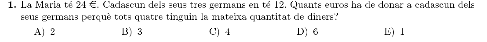

Si Maria dóna $x$ euros a cadascun dels germans, ella es quedarà amb $24-3x$ euros, i els seus germans en tindran $12+x$. Per tal que tots acaben amb la
mateixa quantitat:

$$
24-3x=12+x \quad\Rightarrow\quad 12=4x \quad\Rightarrow\quad x=3
$$
Per tant, Maria ha de donar $3$ € a cada germà.

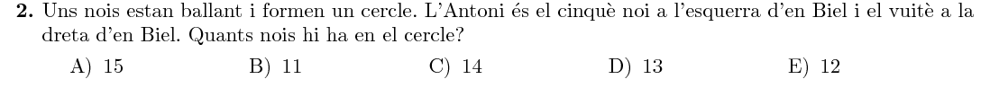

Si Antoni és el cinquè a l'esquerra, vol dir que hi ha $4$ nois entre els dos
(per l'esquerra). Si és el vuitè per la dreta, hi ha $7$ entre tots dos (per la
dreta). En total són ells dos més els que tenen entre ells:

$$
2+4+7=13
$$
En total hi ha $13$ nois al cercle.

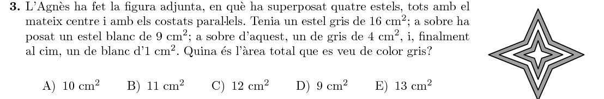

Hi ha dues zones grises: la primera és la resta entre l'estel més gran i el segon
més gran. La segona és la resta entre el segon estel més petit i el més petit.
La suma és:

$$
(16-9)+(4-1)=7+3=10\text{ cm}^2
$$
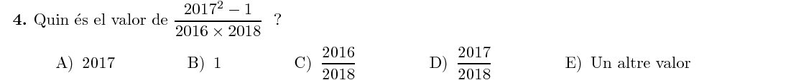

Si al numerador li sumem i restem $2017$, tenim:
$$
2017^2+2017-2017-1=2017\times2018-2017-1=\\
=2017\times2018-2018=2016\times2018
$$
Veiem que el numerador és igual que el denominador, i per tant la fracció és $1​$.

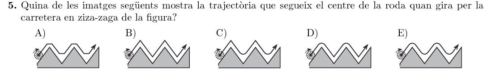

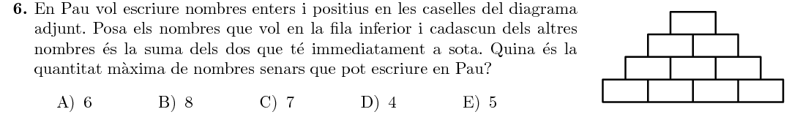

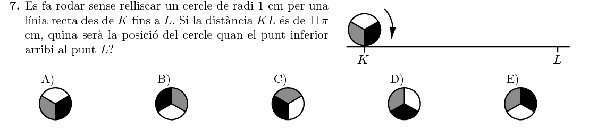

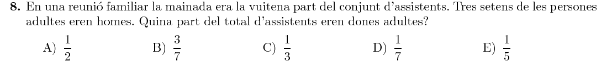

Si la mainada és la vuitena part dels assistents, $\frac78$ dels assistents
són adults. Dels adults, si $\frac37$ són homes, llavors $\frac47$ són dones.
En total, la proporció de dones és:

$$\text{dones}=\frac78\cdot\frac47=\frac48=\frac12$$

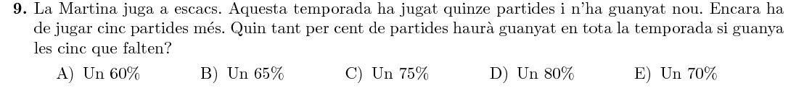

Si guanya les $5$ partides que li queden, en total n'haurà guanyat
$9+5=14$, d'un total de $15+5=20$. El percentatge de victòries és:

$$\frac{14}{20}\cdot100=14\cdot5=70\%$$

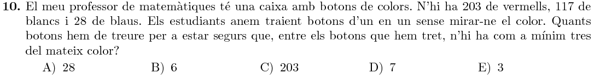

Els estudiants poden traure $6$ botons i que no n'hi hagen tres del mateix color
(si són $2$ vermells, $2$ blancs i $2$ blaus). Ara bé, en traure el $7\text{è}$
botó, necessàriament hi haurà $3$ botons del mateix color. Per tant, la solució
és $7$.

### Qüestions de 4 punts

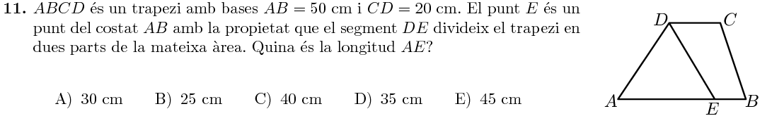

Si l'altura del trapezi (i del triangle) és $h$, les àrees del triangle i del trapezi $EBCD$ són:
$$
A_{AED}=\frac12\cdot AE\cdot h
$$

$$
A_{EBCD}=\frac12\cdot (EB + CD)\cdot h
$$

Si igualem les dues àrees, tenim que:
$$
AE=EB+CD
$$
I si substituïm amb el que sabem:
$$
AE=(50-AE) + 20=70-AE \quad\Rightarrow\quad AE=35\text{ cm}
$$
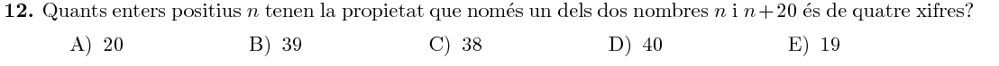

Si només un dels dos nombres $(n,\; n+20)$ és de $4$ xifres, hi ha dues opcions:
o bé $n$ és de tres xifres i $n+20$ de quatre, o bé $n$ és de quatre xifres
i $n+20$ és de cinc xifres. Vegem cadascun dels casos.

Per tal que $n$ siga de tres xifres i $n+20$ siga de quatre, $n$ pot ser:

$$n\in\{980,\; 981,\, \ldots,\; 999\}\quad\rightarrow\quad 20\text{ nombres}$$

Per tal que $n$ siga de quatre xifres i $n+20$ siga de cinc, $n$ pot ser:

$$n\in\{9980,\; 9981,\, \ldots,\; 9999\}\quad\rightarrow\quad 20\text{ nombres}$$

En total, hi ha $40$ nombres $n$ que compleixen la propietat de l'enunciat.

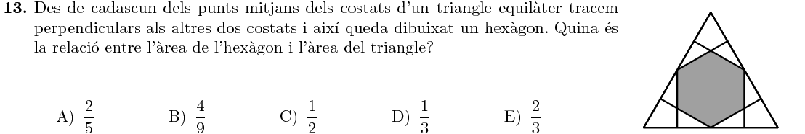

Podem dividir la figura en $6$ parts iguals (des del centre de l'hexàgon), i estudiar la proporció en aquestes porcions:

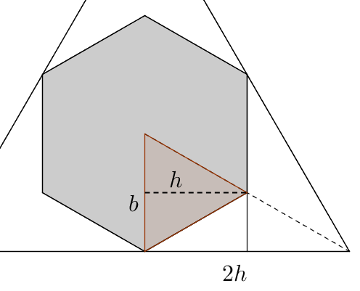

La zona ombrejada és un triangle amb la base $b$ i altura $h$, mentre que el total és un triangle amb base $b$ i altura $2h$ (recordem que les perpendiculars al triangle gran tallen els costats oposats al punt mig).

Per tant, l'àrea ombrejada és la meitat de la total, i la relació és $\frac12$.

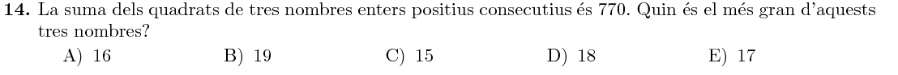

Si anomenem $x$ el nombre d'enmig dels tres, tenim que:
$$
(x-1)^2 + x^2 + (x+1)^2=\\
=x^2-2x+1+x^2+x^2+2x+1=\\
=3x^2+2=770
$$
Per tant:
$$
3x^2=768\quad\Rightarrow\quad x^2=256\quad\Rightarrow\quad x=16
$$
Finalment, el més gran dels tres nombres és $x+1=17$.

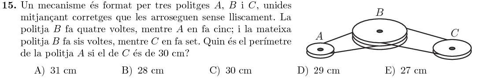

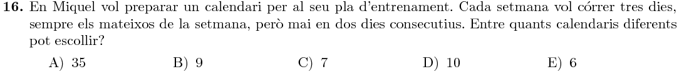

Podem comptar totes les opcions:
$$
\begin{array}{rccccccc}
1&\circ&\_&\circ&\_&\circ&\_&\_\\
2&\circ&\_&\circ&\_&\_&\circ&\_\\
3&\circ&\_&\circ&\_&\_&\_&\circ\\
4&\circ&\_&\_&\circ&\_&\circ&\_\\
5&\circ&\_&\_&\circ&\_&\_&\circ\\
6&\circ&\_&\_&\_&\circ&\_&\circ\\
7&\_&\circ&\_&\circ&\_&\circ&\_\\
8&\_&\circ&\_&\circ&\_&\_&\circ\\
9&\_&\circ&\_&\_&\circ&\_&\circ\\
10&\_&\_&\circ&\_&\circ&\_&\circ\\
\end{array}
$$
En total, hi ha $10$ possibles calendaris per escollir.

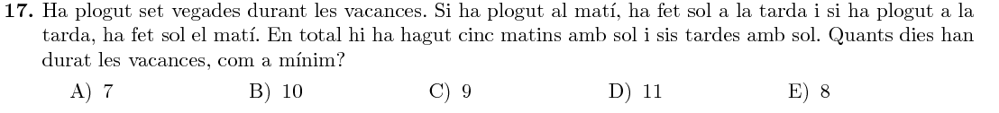

Podem considerar que els primers $7$ dies ha plogut, i per tant haurà fet sol en $7$ moments (matí o tarda). Com ha fet sol de tarda un dia més en total, repartim els $7$ moments de sol en $4$ dies de sol de tarda i $3$ dies de sol de matí (dels $7$ dies de pluja). Per arribar $5$ matins i $6$ tardes de sol, caldran dos dies més. Per exemple:
$$
\begin{array}{rcccccccccccccc}
\text{Dia} & & 1& 2& 3& 4& 5& 6& 7& 8& 9 \\ \hline
\text{Matí} & & P& P& P& P& S& S& S& S& S \\
\text{Tarda}  & & S& S& S& S& P& P& P& S& S \\
\end{array}
$$
Així, calen $9$ dies com a mínim.

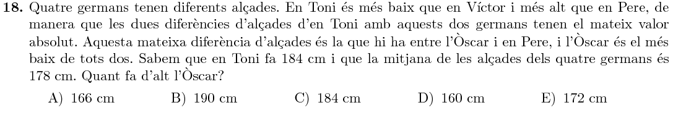

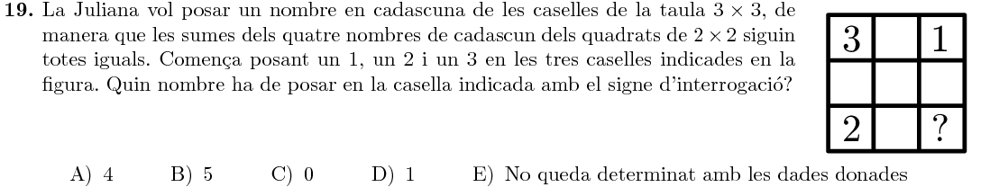

Adonem-nos que només hi ha $4$ quadrats $2\times2$, i que tots ells inclouen la casella central; per tant, la casella central no influeix en la suma i podem posar-hi un $0$ per comoditat. Si anomenem $a,b,c,d$ les altres caselles, tenim el quadrat:
$$
\begin{array}{ccc}
3 & a & 1\\
d & 0 & b\\
2 & c & ?\\
\end{array}
$$
I les quatre sumes que han de ser iguals són:
$$
3+a+d = 1+a+b=2+d+c=b+c+?
$$
De la primera igualtat deduïm que:
$$
3+a+d=1+a+b\quad\Rightarrow\quad b=2+d
$$
Substituint, a la última de les $4$ igualtats anteriors, tenim que:
$$
2+d+c=2+d+c+?
$$
Per tant, s'ha de complir que $?=0$.

Si continuéssim resolent el sistema, podriem trobar una solució (hi ha infinites):
$$
\begin{array}{ccc}
3 & 0 & 1\\
-2 & 0 & 0\\
2 & 1 & 0\\
\end{array}
$$
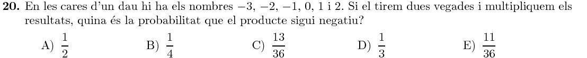

Dels $36$ resultats possibles, seran negatius els que siguin producte d'un nombre positiu per un negatiu o el d'un negatiu per un positiu:
$$
P=\frac{2\cdot3 + 3\cdot2}{36}=\frac{12}{36}=\frac13
$$

### Qüestions de 5 punts

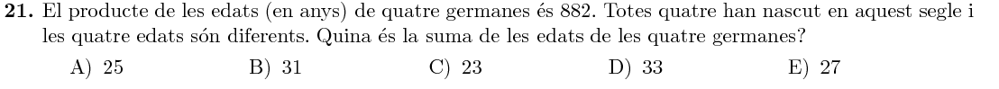

Comencem descomposant $882$ en el seus factors primers:
$$
882=2\cdot3^2\cdot7^2
$$
Com les quatre han nascut a aquest segle, com a molt poden tenir $17$ anys. Començant pel factor $7$, només podrà aparéixer com a $7$ o $14$, ja que qualsevol altre producte serà major que $17$. Dels factors que ens queden $(3^2)$, podem obtenir les dues edats diferents $1$ i $9$. Per tant, les edats són:
$$
\text{edats}=\{1, 7, 9, 14\}
$$
Efectivament, el producte és $1\cdot7\cdot9\cdot14=882$, i la suma és:
$$
1+7+9+14=31
$$
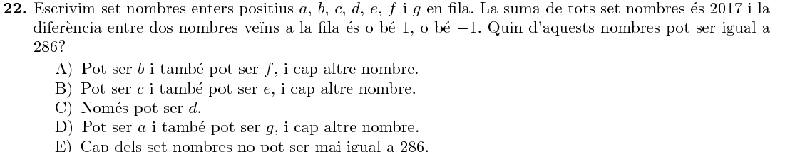

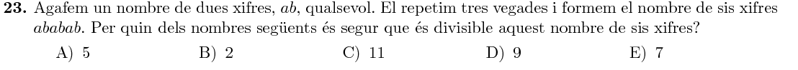

Podem definir el número $ababab$ com la suma:
$$
ababab = 100000a+10000b+1000a+100b+10a+b=\\
=(100000+1000+10)a + (10000+100+1)b=\\
=101010a+10101b
$$
I resulta que $101010=7\cdot14430$ i $10101=7\cdot1443$, per tant:
$$
ababab=7\cdot(14430a+1443b)
$$
Per tant, $ababab$ segur que serà un múliple de $7$.

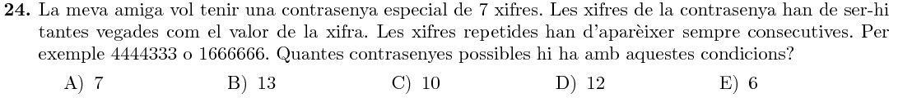

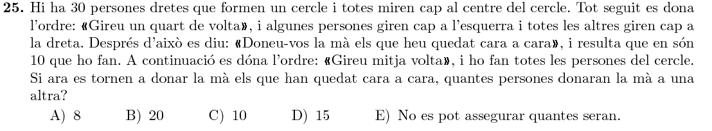

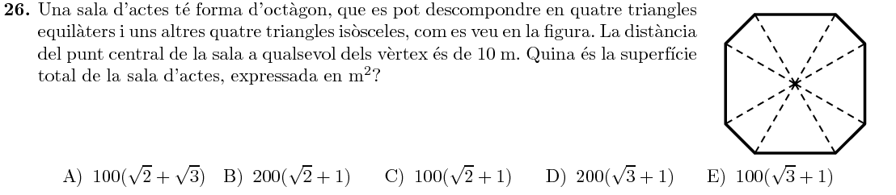

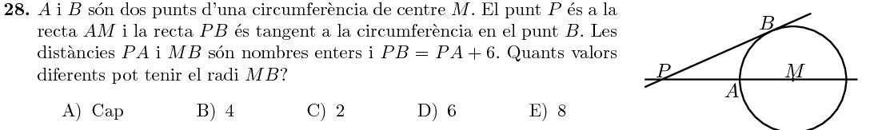

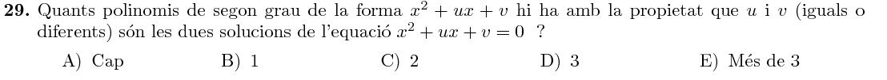

Si $u$ i $v$ són les solucions, tenim l'equació:
$$
x^2+ux+v=(x-u)\cdot(x-v)
$$
Desenvolupant el producte de la dreta:
$$
(x-u)\cdot(x-v)=\\
=x^2-ux-vx+uv=\\
=x^2+(-u-v)\cdot x+uv
$$
Si igualem ara els coeficients dels dos polinomis, tenim el sistema:
$$
\begin{cases}
u = -u -v\\
v = uv
\end{cases}
$$
Per la primera equació tenim que:
$$
v=-2u
$$
Substituint a la segona:
$$
-2u = u\cdot(-2u)\quad\Rightarrow\quad u=u^2\quad\Rightarrow\quad u = {0, 1}
$$
Per tant, hi ha $2$ possibles solucions:
$$
(u, v)=\left\{(0, 0), (1, -1)\right\}
$$
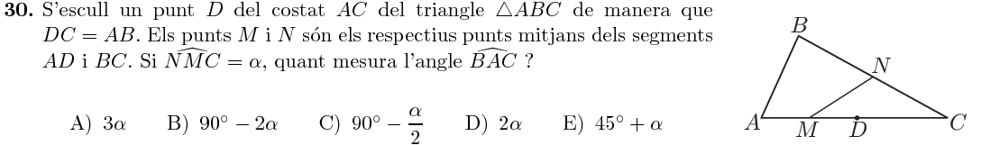

