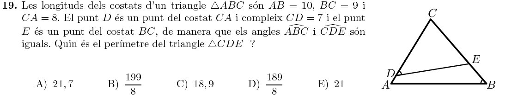
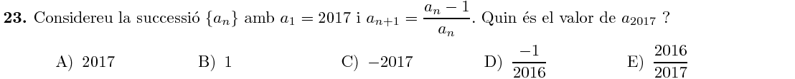

Title: Solucions del Cangur 2017 a Catalunya: Nivell 2n de batxillerat
Date: 2017-5-19 12:00
Amagarportada: True
Tags: cangur, matemàtiques
Category: cangur
Keywords: 2017
Slug: solucions-cangur-2017-catalunya-2n-batx
Description: Recull de solucions del nivell de 2n de batxillerat de les Proves Cangur 2017 a Catalunya

Ja he preparat el recull de solucions del Nivell de 2n de batxillerat del Cangur de Catalunya de 2017. Els enunciats estan extrets del primer model d'examen del [pdf d'enunciats](enunciat_2017_cat_2n_batx.pdf){:target="_blank"}.

Les solucions estan amagades (cal fer clic per mostrar-les) perquè és recomanable pensar detingudament cada problema abans de mirar la solució que jo proposo!

Podeu accedir a les qüestions directament:

* Qüestions de 3 punts: [1](#questio-1), [2](#questio-2), [3](#questio-3), [4](#questio-4), [5](#questio-5), [6](#questio-6), [7](#questio-7), [8](#questio-8), [9](#questio-9), [10](#questio-10).
* Qüestions de 4 punts: [11](#questio-11), [12](#questio-12), [13](#questio-13), [14](#questio-14), [15](#questio-15), [16](#questio-16), [17](#questio-17), [18](#questio-18), [19](#questio-19), [20](#questio-20).
* Qüestions de 5 punts: [21](#questio-21), [22](#questio-22), [23](#questio-23), [24](#questio-24), [25](#questio-25), [26](#questio-26), [27](#questio-27), [28](#questio-28), [29](#questio-29), [30](#questio-30).

Els enunciats del Cangur són propietat de la Societat Catalana de Matemàtiques
i *Le Kangourou sans Frontières*.

### Qüestions de 3 punts

Operem:
$$
\frac{20\cdot17}{2+0+1+7}=\frac{20\cdot17}{10}=\frac{20}{10}\cdot17=2\cdot17=34
$$

La suma dels angles d'un polígon convex sempre és un múltiple de $180$. Vegem quin és el següent múltiple de $180$ després de $2017$:
$$
2017=11\cdot180 + 37
$$
Per tant, l'angle que falta mesura:
$$
\text{angle} = 180-37=143^\circ
$$

A simple vista es pot veure que no es pot fer eliminant només $2$ ponts, però sí eliminant-ne $3$:

Podem expressar la igualtat com:
$$
0.75a=0.4b\quad\Rightarrow\quad\frac34a=\frac25b\quad\Rightarrow\quad15a=8b
$$

Les gràfiques A ens mostra una paràbola que comença a créixer a prop de $x=0$. La gràfica B és compatible amb la corba d'A. La gràfica C ens mostra una corba creixent al voltant de $x\in(1,2)$. La gràfica E ens mostra una gràfica decreixen al voltant de l'interval $x\in(-4,-3)$, cosa que també és compatible.

En canvi, la gràfica D ens mostra una corba que decreix a l'interval $(3,4)$, cosa que no coincideix amb les altres quatre gràfiques.

Com els segments $OB$ i $BC$ són iguals, els dos triangles seran equilàters, i per tanct cada sector circular equival a $\frac16$ del cercle. En total, l'àrea ombrejada és la part del cercle:
$$
A_{\text{ombrejada}} = \frac16+\frac16=\frac13
$$

Calculem les solucions:
$$
\begin{array}{rll}
g_5(x)=-x=x &\Rightarrow& x=0 \\
g_2(x)=x^3= x &\Rightarrow& x=\{0, 1, -1\}\\
g_3(x)=x^4=x &\Rightarrow& x=\{0,1\}\\
g_4(x)=-x^4= x& \Rightarrow& x=0\\
g_1(x)=x^2= x &\Rightarrow& x=\{0,1\}\\
\end{array}
$$
Per tant, $g_2$ és la funció amb més punts en comú amb $f$.

Calculem la probabilitat de triar una bola blava de cada capsa:
$$
P_A=\frac{10}{10+8}=\frac{5}{9} \\
P_B=\frac{6}{6+4}=\frac{3}{5} \\
P_C=\frac{8}{8+6}=\frac{4}{7} \\
P_D=\frac{7}{7+7}=\frac{1}{2} \\
P_E=\frac{12}{12+9}=\frac{4}{7} \\
$$
La major d'aquestes fraccions és $P_B=\frac35$. Ho podem comprovar triant un denominador comú:
$$
P_B=\frac35=\frac{27}{45} > \frac{25}{45} = \frac{5}{9} = P_A \\
P_B=\frac35=\frac{21}{35} > \frac{20}{35} = \frac{4}{7} = P_C=P_E \\
P_B=\frac35=\frac{6}{10} > \frac{5}{10} = \frac{1}{2} = P_D
$$

Es tracta d'una recta que no passa per l'origen, per tant no pot ser que passi pels quatre quadrants. Vegem per quins sí que passa:
$$
\begin{array}{lclcl}
x=-1 &\Rightarrow& f(-1)=3.5+7=10.5&\Rightarrow& (-1, 10.5)\in\text{II} \\
x=1&\Rightarrow& f(1)=-3.5+7=3.5&\Rightarrow& (1, 3.5)\in\text{I} \\
x=3 &\Rightarrow& f(3)=-10.5+7=-3.5&\Rightarrow& (3, -3.5)\in\text{IV} 
\end{array}
$$

### Qüestions de 4 punts

En ordre decreixent, tenim les següents desigualtats:
$$
p+q \quad  >\quad q \quad >\quad p\cdot q\quad >\quad p\quad >\quad \frac{p}{q}
$$
Per tant, $p+q$ és el més major de tots.

Anomenem $h_A, h_B$ les altures dels cilindres i $r_A,r_B$ els radis de les seues bases. Sabem $1.1r_A=r_B$, i els volums són iguals, per tant:
$$
\pi r_A^2h_A = \pi r_B^2h_B \quad\Rightarrow\quad r_A^2h_A = 1.1^2r_A^2h_B \quad\Rightarrow
$$

$$
\Rightarrow\quad h_A=1.1^2h_B\quad\Rightarrow\quad \frac{h_A}{h_B}=1.1^2=1.21
$$

És a dir, l'altura del cilindre $A$ és un $21\%$ més llarga que la de $B$.

Cadascun dels $6$ quadrats està en contacte amb $4$ triangles, però estarem contant cada triangle $3$ cops, ja que cada triangle està en contacte amb $3$ quadrats. Per tant:
$$
N_{\text{triangles}}=\frac{6\cdot4}3=8
$$

La millor opció serà posar una bola negra a cada caixa i totes les blanques en la mateixa caixa. La probabilitat de guanyar serà:
$$
P_C=\frac45 + \frac15\cdot\frac16=\frac{25}{30}=\frac56
$$
És fàcil comprovar que totes les altres opcions donen probabilitats més petites:
$$
\begin{array}{l}
P_A=\frac35\\
P_B=\frac12\\
P_D=\frac15\cdot\frac56=\frac16\\
P_E=\frac45
\end{array}
$$

Si $x$ és una arrel del polinomi, es compleix:
$$
\begin{array}{rrllc}
& 5x^3+ax^2+bx+24&=&0&\Rightarrow\\
\Rightarrow& 5x^3+ax^2+bx&=&-24 &\Rightarrow\\
\Rightarrow& x(5x^2+ax+b)&= &-24
\end{array}
$$
Per tant, $x$ ha de ser un divisor de $-24$, i $5$ és la única opció que no ho és.

El quadrat més gran que podrà formar serà de costat $44$:
$$
44\times44=1936 \text{ fitxes (968 blanques, 968 negres)}
$$
Per tant, li sobraran:
$$
\begin{array}{rcl}
1009-968 &=& 41\text{ fitxes negres}\\
1008-968 &=& 40 \text{ fitxes blanques}
\end{array}
$$

### Qüestions de 5 punts

