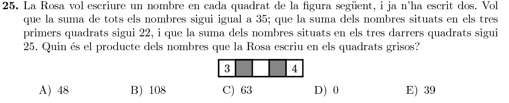

Title: Solucions del Cangur 2017 a Catalunya: Nivell 3r d'ESO
Date: 2017-3-20 12:00
Amagarportada: True
Tags: cangur, matemàtiques
Category: cangur
Slug: solucions-cangur-2017-catalunya-3r-eso
Description: Recull de solucions del nivell de 3r d'ESO de les Proves Cangur 2017 a Catalunya
Status: draft

Aquest és el recull de solucions del Nivell de 3r d'ESO del Cangur de Catalunya de 2017. Els enunciats estan extrets del primer model d'examen del [pdf d'enunciats](enunciat_2017_cat_3r_eso.pdf){:target="_blank"}.
Si trobeu cap errada o teniu algun comentari o solució alternativa, no dubteu en fer un comentari a sota del tot.

Les solucions estan amagades (cal fer clic per mostrar-les) perquè és recomanable pensar detingudament cada problema abans de mirar la solució que jo proposo!

Podeu accedir a les qüestions directament:

* Qüestions de 3 punts:
  [1](#questio-1), [2](#questio-2), [3](#questio-3), [4](#questio-4),
  [5](#questio-5), [6](#questio-6), [7](#questio-7), [8](#questio-8),
  [9](#questio-9), [10](#questio-10)
* Qüestions de 4 punts:
  [11](#questio-11), [12](#questio-12), [13](#questio-13), [14](#questio-14),
  [15](#questio-15), [16](#questio-16), [17](#questio-17), [18](#questio-18),
  [19](#questio-19), [20](#questio-20)
* Qüestions de 5 punts:
  [21](#questio-21), [22](#questio-22), [23](#questio-23), [24](#questio-24),
  [25](#questio-25), [26](#questio-26), [27](#questio-27), [28](#questio-28),
  [29](#questio-29), [30](#questio-30)

Els enunciats del Cangur són propietat de la Societat Catalana de Matemàtiques i *Le Kangourou sans Frontières*.

### Qüestions de 3 punts

Fem la multiplicació:
$$
\begin{array}{cccccccccc}
 & & & & 2 & 2 & 2 & 2 \\
 & & & \times & 2 & 2 & 2 & 2 \\
 \hline
 & & & & 4 & 4 & 4 & 4 \\
 & & & 4 & 4 & 4 & 4 & \\
 & & 4 & 4 & 4 & 4 &   & \\
 + & 4 & 4 & 4 & 4 &  &   & \\
 \hline
 & 4 & 9 & 3 & 7 & 2 &  8 & 4 \\
\end{array}
$$
Només amb la xifra de les unitats i la de les desenes $(...84)$ ja podíem deduir la solució d'entre les opcions. 

Si desplacem tot el perímetre cap a fora, veiem que es correspon amb el d'un quadrat de costat $4$. Per tant, el perímetre és $4\cdot4=16$.

Per l'enunciat sabem que Robert serà el més petit, Santi tindrà $2$ anys més que Robert, i Pilar en tindrà $2$ més que Santi. Com que les edats han d'estar entre $6$ i $10$ (inclosos), hauran de ser:
$$
\text{Robert}\rightarrow6,\quad \text{Pilar}\rightarrow8,\quad \text{Santi}\rightarrow10
$$

Fixem-nos que cada porció grisa té al seu costat una porció blanca amb la mateixa àrea. Per tant, $\frac12$ de l'àrea serà blanca.

En primer lloc, hem de conseguir que la primera xifra sigui un $9$:
$$
\enclose{horizontalstrike}{12345678}91011121314151617181920
$$
Hem esborrat $8$ xifres, i ens queden 16 xifres per esborrar, que ens permeten obtindre com a molt un $7$ com a segona xifra:
$$
\enclose{horizontalstrike}{12345678}9\enclose{horizontalstrike}{101112131415161}7181920
$$
Hem esborrat $15$ xifres més, per tant només ens queda una per esborrar:
$$
\enclose{horizontalstrike}{12345678}9\enclose{horizontalstrike}{101112131415161}7\enclose{horizontalstrike}{1}81920
$$
I el número final és:
$$
9781920
$$

Anomenem $b$ l'amplada del *braç* del sofà (gris), i $s$ l'amplada del seient (blanc). En un sofà de tres places, tenim dos braços i tres seients, per tant:
$$
2b+3s=220
$$
En el sofà de dues places, tenim dos braços i dos seients:
$$
2b+2s=160
$$
Si a la primera equació li restem la segona, tenim que:
$$
s=220-160=60
$$
Finalment, la butaca individual mesura igual que un sofà de dues places menys un seient, per tant:
$$
\text{butaca}=160-60=100
$$

Tenim el sistema d'equacions de $4$ equacions i $4$ incògnites següent:
$$
\begin{cases}
a+b=2 \quad(1)\\
c+d=3 \quad(2)\\
a+c=1 \quad(3) \\
b+d=4 \quad(4)
\end{cases}
$$
Valorem ara les possibles opcions:

* $b$ és igual a $c$: no pot ser, perquè llavors no s'explicat que les equacions $(1)$ i $(2)$ tinguen resultats diferents.
* $a$ és més gran que $d$: no pot ser, perquè llavors l'equació $(1)$ seria més gran que la $(4)$.
* $a$ és igual a $d$: no pot ser, perquè $(1)$ i $(4)$ són diferents.
* $a$ és més petit que $d$: efectivament, si restem les equacions $(1$) i $(4)$, tenim que $a-d=-2$, és a dir, $a=d-2$, i per tant $a$ és més petit que $d$.
* $c$ és més gran que $b$: impossible perquè llavors l'equació $(2)$ hauria de ser més gran que la $(4)$.

Per tant, la solució és que «$a$ és més petit que $d$».

Entre els quatre han marcat $20$ gols, per tant la mitjana serà de $5$ gols per jugador. Com han marcat un nombre diferent de gols, una opció serà:
$$
3, 4, 6, 7
$$
I per tant, en Miquel n'hauria marcat $3$.

Fixem-nos que és impossible que en Miquel en marqui $4$, perquè llavors els altres, com a mínim, en marcarien $5,6,7$, i llavors la suma seria: $4+5+6+7=22$.

L'angle amb l'interrogant és la suma dels altres dos angles que hi ha dibuixats: $60+90=150^\circ$.

Usar la vareta $V3$ doblarà l'efecte del que haja fet abans, així que el millor és afegir un euro abans de doblar i restar l'euro després de doblar. Per tant, la solució és:
$$
V1, V3, V2
$$

### Qüestions de 4 punts

Si canviem l'orientació dels segments, podem construir un triangle equilàter gran amb la línia discontínua com a base. Llavors, la línia negra seran els altres dos costats del triangle equilàter. Com la base mesura $200\text{ m}$, el camí negre mesurarà $2\cdot200=400\text{ m}$.

Primer, ens adonem que a la casella de dalt a l'esquerra hem de posar l'$1$, ja que ha de ser menor que qualsevol altra casella. Llavors, centrant-nos en les dues caselles de dalt a la dreta, podem triar les següents opcions:
$$
23,\;24,\;25,\;34,\;35,\;45
$$
Per cadascuna d'aquestes opcions, les altres dues caselles les podem emplenar d'una sola manera (amb el nombre menor a dalt i el major a baix). Aquestes $6$ maneres són:
$$
\begin{array}{cccccccccc}
1&2&3&&1&2&4&&1&2&5\\
4&&&&3&&&&3&&\\
5&&&&5&&&&4&&\\
\\
1&3&4&&1&3&5&&1&4&5\\
2&&&&2&&&&2&&\\
5&&&&4&&&&3&&\\
\end{array}
$$

Anomenem $c$ el costat del quadrat final. Reconstruirem el rectangle partint del quadrat, apuntant a cada passa la longitud dels dos costats del paral·lelogram:
$$
(c, c)\rightarrow(2c, c)\rightarrow(4c, c)\rightarrow(8c, c)
$$
Fixem-nos que no podem passar de $(2c, c)$ a $(2c, 2c)$ perquè l'enunciat ens diu que només al final tenim un quadrat.

El perímetre del rectangle és:
$$
2\cdot(8c+c)=18c=252\quad \Rightarrow\quad c=14
$$
Finalment, el costat llarg del rectangle inicial és:
$$
\text{costat llarg}=8c=8\cdot14=112
$$

El producte de dos nombres diferents per $2$ o de dos nombres diferents per $3$, serà diferent. Com a molt, podrem fer que els productes de dos nombres per $2$ siguin iguals als productes de dos nombres per $3$. Per exemple, amb els números:
$$
\begin{array}{cccc}
1 &\rightarrow & 2\cdot1 &=& 2\\
2 &\rightarrow & 3\cdot2 &=& 6\\
3 &\rightarrow & 2\cdot3 &=& 6\\
4 &\rightarrow & 3\cdot4 &=& 12\\
6 &\rightarrow & 2\cdot6 &=& 12\\
\end{array}
$$
Com a mínim, podrem obtenir $3$ resultats diferents.

Podem dividir la figura en petits triangles equilàters iguals:

La part que està ocupada pel color blanc és:
$$
\text{blanc}=\frac{12}{16}=\frac34
$$

Primer, observem que hi ha $6$ sumes diferents, que ens poden donar valors distints. Per exemple, amb els nombres $0,1,2,$4:
$$
0+1=1 \\
0+2=2 \\
0+4=4 \\
1+2=3 \\
1+4=5 \\
2+4=6
$$
Si anomenem $a,b,c,d$ els quatre nombres, les sis sumes diferents són:
$$
a+b\\
a+c\\
a+d\\
b+c\\
b+d\\
c+d
$$
D'aquestes sis sumes diferents, és possible que dues siguen iguals. Per ser-ho, però, els sumands de cada costat de la igualtat han de ser totalment diferents (per exemple, no val $a+b=b+c$, perquè la $b$ està als dos costats i llavors $a=c$). Per exemple, podria ser que:
$$
a+b=c+d
$$
De fet, aquesta és la única igualtat possible, ja que qualsevol altra igualtat, com per exemple $a+c=b+d$, entraria en contradicció. En efecte, si sumem les dues equacions, tenim:
$$
(a+b)+(a+c)=(c+d)+(b+d) \quad\Rightarrow\quad 2a=2d\quad\Rightarrow\quad a=d
$$
I no pot ser perquè els quatre nombres han de ser diferents. En definitiva, la suma pot donar $5$ resultats diferents o $6$ resultats diferents, però cal altra quantitat.

Per acabar, un exemple de $5$ resultats diferents és $0,1,2,3$:
$$
0+1=1 \\
0+2=2 \\
0+3=3 \\
1+2=3 \\
1+3=4 \\
2+3=5
$$

Tenim dues opcions: que $A$ sigui un nombre de tres xifres i $A+10$ no ho sigui, o que $A+10$ sigui de tres xifres però $A$ no. Per cada cas, tenim $10$ opcions diferents:

* $A=\{990, 991, 992, \ldots, 999\}$. Per qualsevol d'aquests $10$ valors de $A$, $A+10$ tindrà quatre xifres.
* $A=\{90, 91, 92,\ldots,99\}$. Per aquests $10$ valors de $A$, $A+10$ tindrà tres xifres.

En total, hi ha $20$ nombres naturals $A$ amb aquesta propietat.

Si ens fixem en les rajoles quadrades, veiem que totes menys una es veuen igual des de cada costat (a la dreta). Per tant, només hem de moure una rajola quadrada perquè coincideixien tots els punts de vista. Només hi ha una opció que contempli l'intercanvi d'una sola parella de rajoles quadrades, i serà la solució (la **E** en este cas).

Si comencem posant un nombre senar a dalt de tot, a sota d'ell ha d'haver-hi un senar i un parell:
$$
\begin{array}{ccc}
&S&\\
S&&P\\
\end{array}
$$
Com a molt, podrem posar dos nombres senars a sota:
$$
\begin{array}{ccccc}
&&S&&\\
&S&&P&\\
P&&S&&S\\
\end{array}
$$
I a sota del tot, podem posar $3$ senars com a molt:
$$
\begin{array}{ccccccc}
&&&S&&&\\
&&S&&P&&\\
&P&&S&&S&\\
S&&S&&P&&S\\
\end{array}
$$
En total, hem posat $7$ nombres senars.

Mai podrem posar $8$ nombres senars, perquè llavors només en tindríem $2$ de parells. Si provem, veiem que necessàriament hi ha d'haver algun dels dos nombres parells a la base i és impossible evitar que n'acaben apareixent més de $2$.

Només hi ha un cub que podem dividir en les nou peces:

### Qüestions de 5 punts

Comencem per les dues regions centrals, que estan en contacte amb tota la resta. Aquestes s'han de pintar de dos colors diferents, i per tant tenim $3\cdot4=12$ opcions diferents.

Les altres dues regions dels costats (esquerra i dreta), poden tenir qualsevol dels altres dos colors restants sense cap restricció, ja que no es toquen entre elles: $2\cdot2=4$ opcions.

En total, hi ha $12\cdot4=48$ maneres diferents de pintar el mapa.

Observem que la marieta ha caminat $\frac34$ de la longitud del pal, però començava des del final. Per tant es troba a la posició $1-\frac34=\frac14$.

La separació és:
$$
\text{separació} = \frac23-\frac14=\frac{8-3}{12}=\frac5{12}
$$

Anomenem $x$ el nombre de participants. Llavors, hi ha $0.35x$ noies i $0.65x$ nois. La diferència és $252$:
$$
0.65x-0.35x=0.3x=252 \quad\Rightarrow\quad x=\frac{252}{0.3}=840
$$

Només hi ha dues sumes que tenen un resultat múltiple de $5$:
$$
3+12=15,\quad8+12=20
$$
El sumand repetit a les dues sumes és $12$, i per tant aquestà serà l'edat de la Neus. Llavors, la Sara i la Joana tindran $3$ o $8$ anys cadascuna (els altres sumands de les dues sumes anteriors). Finalment, la Rita tindrà el número d'anys que queda: $14$ anys.

Anomenem $a, b, c$ els tres nombres amb què omplirà la graella, que han de complir:
$$
\begin{array}{rclcc}
3+a+b+c+4&=&35 & \\
3+a+b&=&22 &\Rightarrow & a=19-b\\
b+c+4&=&25 &\Rightarrow & c=21-b\\
\end{array}
$$
Substituim a la primera equació:
$$
3+(19-b)+b+(21-b)+4=\\
=47-b=35\quad\Rightarrow \\
b=12
$$
Per tant, $a$ i $c$ valen:
$$
a=19-12=7\\
c=21-12=9
$$
I el seu producte és:
$$
a\cdot c=7\cdot9=63
$$

Els punts que marca en Simó són:
$$
\frac{1}{12},\ \frac{2}{12},\ \frac{3}{12},\ \frac{4}{12},\ \frac{5}{12},\ \frac{6}{12},\ \frac{7}{12},\ \frac{8}{12},\ \frac{9}{12},\ \frac{10}{12},\ \frac{11}{12}
$$
Simplifiquem les fraccions:
$$
\frac{1}{12},\ \frac{1}{6},\ \frac{1}{4},\ \frac{1}{3},\ \frac{5}{12},\ \frac{1}{2},\ \frac{7}{12},\ \frac{2}{3},\ \frac{3}{4},\ \frac{5}{6},\ \frac{11}{12}
$$
Els punts que marca Bàrbara són:
$$
\frac18,\ \frac28,\ \frac38,\ \frac48,\ \frac58,\ \frac68,\ \frac78
$$
Que simplificant són:
$$
\frac18,\ \frac14,\ \frac38,\ \frac12,\ \frac58,\ \frac34,\ \frac78
$$
En total, Simó ha fet $11$ marques, i Bàrbara n'ha fet $7$. Però han coincidit en $3$: $\frac14, \frac12, \frac34$. Per tant, hi havia un total de $11+7-3=15$ marques, les quals divideixen el cordill en $15+1=16$ trossos.

La única forma d'omplir la graella és (després ho justifiquem):
$$
\begin{array}{ccc}
2&3&2\\
3&2&3\\
2&3&2
\end{array}
$$
Totes les parelles de caselles contigües sumen $5$, i en total, la suma de tots els nombres és: $5\cdot2+4\cdot3=10+12=22$.

Per justificar com hem omplit la graella, anemenem $x$ el nombre que va a la dreta del $2$ original, i $y$ el nombre a sota de $x$ (a l'esquerra del $3$). Llavors, sabem que $2+x=x+y=y+3$. De la igualtat esquerra deduïm que $y=2$, i de la igualtat dreta que $x=3$. Si repetim el procediment, veiem que al final la taula quedarà plena de dosos i tresos alternativament.

L'àrea ombrejada és la de dos triangles de base $1$ i altura $4$ (la meitat del costat del quadrat). Per tant, en total mesura:
$$
A=2\cdot\left(\frac12\cdot1\cdot4\right)=4
$$

Dels $7$ dies de la setmana, pot triar:
$$
\begin{array}{cccc}
(1, 3),& (1, 4),& (1, 5),& (1, 6), \\
(2, 4),& (2, 5),& (2, 6),& (2, 7),\\
(3, 5),& (3, 6),& (3, 7),\\
(4, 6),& (4, 7),\\
(5, 7)
\end{array}
$$
En total, pot configurar $14$ calendaris diferents.

En total, el cub gros té $4^3=64$ cubs petits.

De cubets grisos, tenim un nucli de $2\times2\times2$, més un quadrat de $2\times2\times1$ a cada cara del cub gros ($6$ cares en total). Per tant, hi ha:
$$
\text{cubets grisos}=2^3+6\cdot2^2=8+24=32
$$
Per tant, un $50\%$ del cub gros és de color gris.