Title: Solucions del Cangur 2017 a Catalunya: Nivell 4t d'ESO
Date: 2017-3-20 12:00
Amagarportada: True
Tags: cangur, matemàtiques
Category: cangur
Slug: solucions-cangur-2017-catalunya-4t-eso
Description: Recull de solucions del nivell de 4t d'ESO de les Proves Cangur 2017 a Catalunya
Status: draft

Ja he preparat el recull de solucions del Nivell de 4t d'ESO del Cangur de Catalunya de 2017. Els enunciats estan extrets del primer model d'examen del [pdf d'enunciats](enunciat_2017_cat_4t_eso.pdf){:target="_blank"}. Les solucions estan amagades (cal fer clic per mostrar-les) perquè és recomanable pensar detingudament cada problema abans de mirar la solució que jo proposo!

Podeu accedir a les qüestions directament:

* Qüestions de 3 punts: [1](#questio-1), [2](#questio-2), [3](#questio-3), [4](#questio-4), [5](#questio-5), [6](#questio-6), [7](#questio-7), [8](#questio-8), [9](#questio-9), [10](#questio-10).
* Qüestions de 4 punts: [11](#questio-11), [12](#questio-12), [13](#questio-13), [14](#questio-14), [15](#questio-15), [16](#questio-16), [17](#questio-17), [18](#questio-18), [19](#questio-19), [20](#questio-20).
* Qüestions de 5 punts: [21](#questio-21), [22](#questio-22), [23](#questio-23), [24](#questio-24), [25](#questio-25), [26](#questio-26), [27](#questio-27), [28](#questio-28), [29](#questio-29), [30](#questio-30).

Els enunciats del Cangur són propietat de la Societat Catalana de Matemàtiques i *Le Kangourou sans Frontières*.

### Qüestions de 3 punts

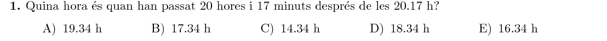

Després de $17$ minuts, són les $20.34$. Després de $4$ hores són les $00.34$, i $16$ hores després, finalment, són les $16.34\text{ h}$.

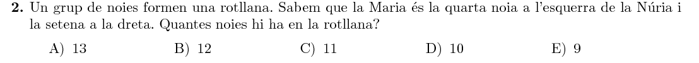

Entre Núria i Maria hi ha $3$ noies per una banda i $6$ per l'altra. En total, són:
$$
N=3+6+1+1=11
$$
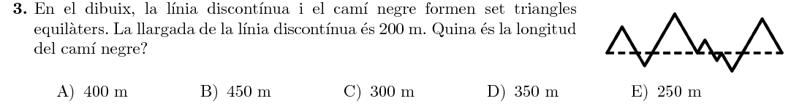

Si canviem l'orientació dels segments, podem construir un triangle equilàter gran amb la línia discontínua com a base. Llavors, la línia negra seran els altres dos costats del triangle equilàter. Com la base mesura $200\text{ m}$, el camí negre mesurarà $2\cdot200=400\text{ m}$.

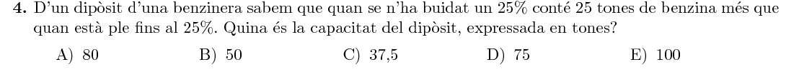

Expressem l'enunciat amb una equació, en què $x$ és la capacitat del dipòsit, i la resolem:
$$
0.75x = 0.25x+25\quad\Rightarrow\quad 0.5x=25\quad\Rightarrow\quad x=50
$$
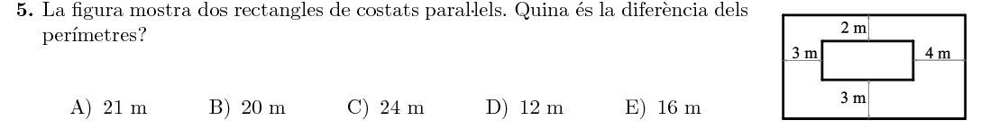

Tenim les mesures de la diferència entre costats, i la diferència dels perímetres és el doble de la suma d'aquestes diferències:
$$
D=2\cdot(3+2+4+3)=24\text{ m}
$$
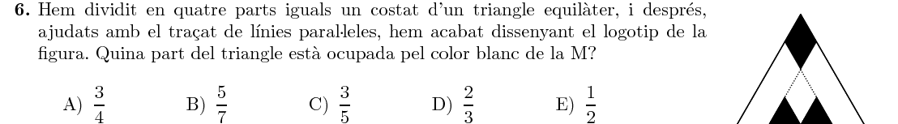

Podem dividir la figura en petits triangles equilàters iguals:

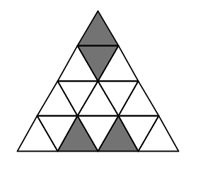

La part que està ocupada pel color blanc és:
$$
\text{blanc}=\frac{12}{16}=\frac34
$$
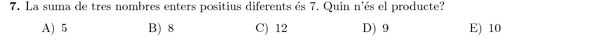

La única forma de sumar $7$ amb tres nombres naturals diferents és:
$$
7=1+2+4
$$
I el seu producte és $1\cdot2\cdot4=8$.

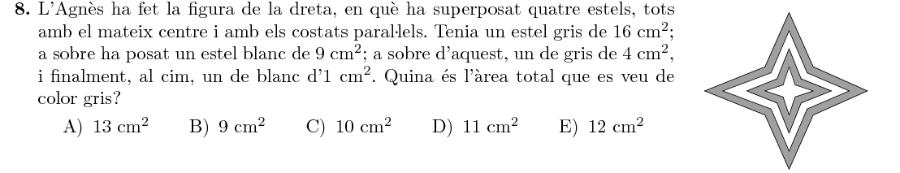

Hi ha dues zones grises: la primera és la resta entre l'estel més gran i el segon
més gran. La segona és la resta entre el segon estel més petit i el més petit.
La suma és:
$$
A=(16-9)+(4-1)=7+3=10\text{ cm}^2
$$
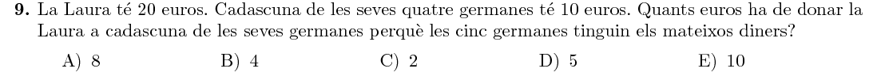

Si Laura dóna $x$ euros a cada germana, per tal que totes tinguin els mateixos diners cal que:
$$
20-4x=10+x \quad\Rightarrow\quad 5x=10 \quad\Rightarrow\quad x=2
$$
I totes es queden amb $12$ euros.

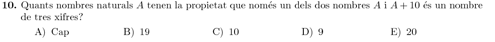

Tenim dues opcions: que $A$ sigui un nombre de tres xifres i $A+10$ no ho sigui, o que $A+10$ sigui de tres xifres però $A$ no. Per cada cas, tenim $10$ opcions diferents:

- $A=\{990,\ 991,\ 992,\ \ldots,\ 999\}$. Per qualsevol d'aquests $10$ valors de $A$, $A+10$ tindrà quatre xifres.
- $A=\{90,\ 91,\ 92,\ \ldots,\ 99\}$. Per aquests $10$ valors de $A$, $A+10$ tindrà tres xifres.

En total, hi ha $20$ nombres naturals $A$ amb aquesta propietat.

### Qüestions de 4 punts

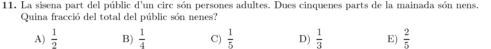

Si $\frac16$ són adults, $\frac56$ són nens i nenes. D'aquests, $\frac25$ són nens i $\frac35$ són nenes. En total:
$$
P_{\text{nenes}}=\frac56\cdot\frac35=\frac{15}{30}=\frac12
$$
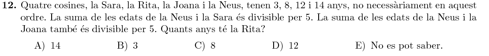

Només hi ha dues sumes que tenen un resultat múltiple de $5$:
$$
3+12=15,\quad8+12=20
$$
El sumand repetit a les dues sumes és $12$, i per tant aquestà serà l'edat de la Neus. Llavors, la Sara i la Joana tindran $3$ o $8$ anys cadascuna (els altres sumands de les dues sumes anteriors). Finalment, la Rita tindrà el número d'anys que queda: $14$ anys.

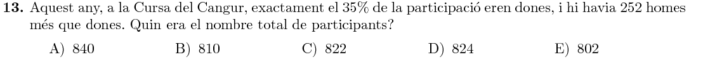

Anomenem $x$ el nombre total de participants. Segons l'enunciat, hi ha $0.35x$ dones i $252 + 0.35x$ homes. En total:
$$
(252+0.35x) + 0.35x = x
$$
Resolem l'equació:
$$
252=0.3x\quad\Rightarrow\quad x=\frac{252}{0.3}=840
$$
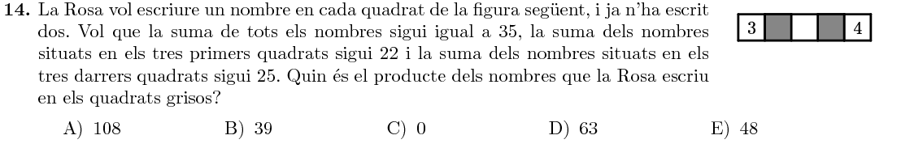

Anomenem $a,b,c$ els tres nombres que faltes (d'esquerra a dreta). Llavors tenim les equacions:
$$
\begin{cases}
3&+&a&+&b&+&c&+&4&=&35 \\
3&+&a&+&b&&&&&=&22\\
&&&&b&+&c&+&4&=&25
\end{cases}
$$
Si a la primera equació li restem les altres dues, tenim:
$$
-b=35-22-25=-12\quad\Rightarrow\quad b=12
$$
Substituint a la segona i tercera equacions, deduim que:
$$
3+a+12=22\quad\Rightarrow\quad a=7\\
12+c+4=25\quad\Rightarrow\quad c=9
$$
El producte dels nombres dels quadrats grisos $(a,c)$ és:
$$
a\cdot c=7\cdot9=63
$$
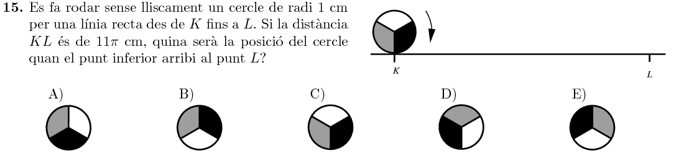

El cercle pega una volta sencera cada $2\pi\text{ cm}$. Després de $11\pi\text{ cm}$ haurà pegat $5$ voltes completes (es trobarà en la posició inicial), i després pegarà mitja volta. Llavors, la posició final serà la **E**.

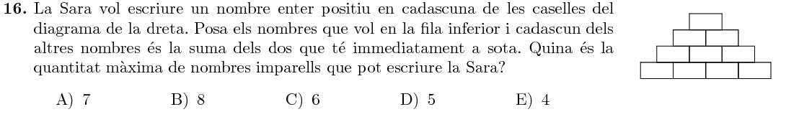

Si comencem posant un nombre senar a dalt de tot, a sota d'ell ha d'haver-hi un senar i un parell:
$$
\begin{array}{ccc}
&S&\\
S&&P\\
\end{array}
$$
Com a molt, podrem posar dos nombres senars a sota:
$$
\begin{array}{ccccc}
&&S&&\\
&S&&P&\\
P&&S&&S\\
\end{array}
$$
I a sota del tot, podem posar $3$ senars com a molt:
$$
\begin{array}{ccccccc}
&&&S&&&\\
&&S&&P&&\\
&P&&S&&S&\\
S&&S&&P&&S\\
\end{array}
$$
En total, hem posat $7$ nombres senars.

Mai podrem posar $8$ nombres senars, perquè llavors només en tindríem $2$ de parells. Si provem, veiem que necessàriament hi ha d'haver algun dels dos nombres parells a la base i és impossible evitar que n'acaben apareixent més de $2$.

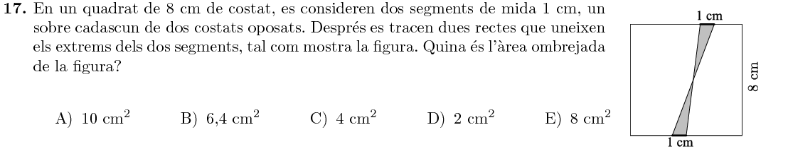

L'àrea ombrejada és la de dos triangles de base $1$ i altura $4$ (la meitat del costat del quadrat). Per tant, en total mesura:
$$
A=2\cdot\left(\frac12\cdot1\cdot4\right)=4\text{ cm}^2
$$
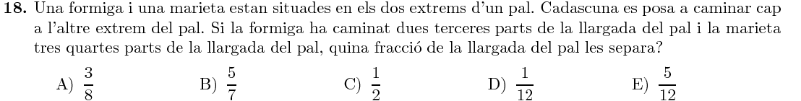

Observem que la marieta ha caminat $\frac34$ de la longitud del pal, però començava des del final. Per tant es troba a la posició $1-\frac34=\frac14$.

La separació és:
$$
\text{separació} = \frac23-\frac14=\frac{8-3}{12}=\frac5{12}
$$
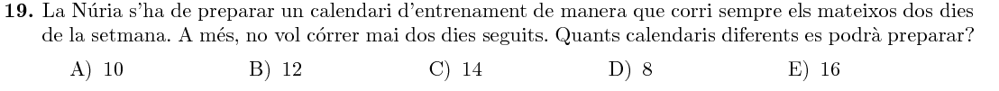

Dels $7$ dies de la setmana, pot triar:
$$
\begin{array}{cccc}
(1, 3),& (1, 4),& (1, 5),& (1, 6), \\
(2, 4),& (2, 5),& (2, 6),& (2, 7),\\
(3, 5),& (3, 6),& (3, 7),\\
(4, 6),& (4, 7),\\
(5, 7)
\end{array}
$$
En total, pot configurar $14$ calendaris diferents.

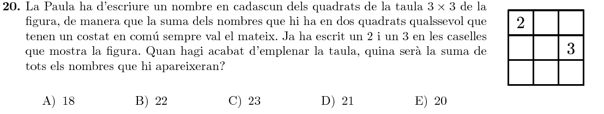

La única forma d'omplir la graella és (després ho justifiquem):
$$
\begin{array}{ccc}
2&3&2\\
3&2&3\\
2&3&2
\end{array}
$$
Totes les parelles de caselles contigües sumen $5$ . En total, tenim cinc dosos i quatre tresos, i la suma és: 
$$
S=5\cdot2+4\cdot3=10+12=22
$$
Per justificar com hem omplit la graella, anemenem $x$ el nombre que va a la dreta del $2$ original, i $y$ el nombre a sota de $x$ (a l'esquerra del $3$). Llavors, sabem que $2+x=x+y=y+3$. De la igualtat esquerra deduïm que $y=2$, i de la igualtat dreta que $x=3$. Si repetim el procediment, veiem que al final la taula quedarà plena de dosos i tresos alternativament.

### Qüestions de 5 punts

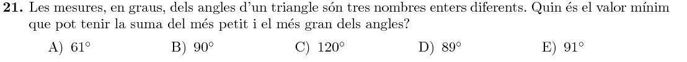

Observem primer que com a mínim la suma haurà de valer $91^\circ$. Si fóra $90^\circ$ o menys, el tercer angle mesuraria $180-90=90^\circ$, i per tant seria el més gran dels tres, cosa que no pot ser.

Finalment, comprovem que la suma sí que pot ser $91^\circ$, cosa que ocorreria amb un triangle d'angles $(1^\circ, 89^\circ, 90^\circ)$.

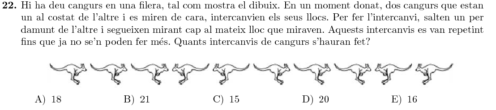

Esquematitzem la figura posant fletxes enlloc de cangurs:
$$
\begin{array}
\rightarrow&\rightarrow& \rightarrow&\leftarrow& \leftarrow&\rightarrow& \rightarrow& \rightarrow& \leftarrow& \leftarrow
\end{array}
$$
Cada fletxa avançarà totes les que tingui en la direcció contrària més enllà de la direcció cap on apunta:
$$
\begin{array}{ccccccccccc}
\rightarrow&\rightarrow& \rightarrow&\leftarrow& \leftarrow&\rightarrow& \rightarrow& \rightarrow& \leftarrow& \leftarrow \\
4&4&4&3&3&2&2&2&6&6
\end{array}
$$
La suma és:
$$
4+4+4+3+3+2+2+2+6+6=36
$$
Fixem-nos, però, que hem comptat cada salt dues vegades, i per tant en total s'han fet $36\div2=18$ intercanvis.

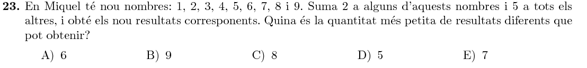

Per obtindre dues sumes iguals, haurem de sumar $5$ i $2$ a parelles de nombres que tinguen una diferència de $3$. Com a molt, podem trobar tres d'aquestes parelles:
$$
(1,4),\quad (2,5),\quad(3,6)
$$
En total, tindrem $9-3=6$ sumes diferents.

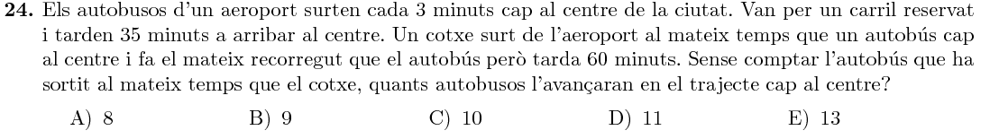

Abans que el cotxe arribe (en $60$ minuts), hauran arribat els següents busos que han sortit en $3,6,\ldots$ minuts, els quals hauran arribat en:
$$
38, 41, 44, 47, 50, 53, 56, 59 \text{ minuts}
$$
En total, l'han avançat $8$ autobusos.

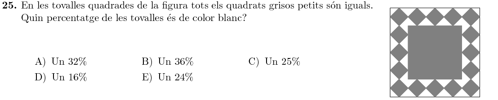

En primer lloc, observem que el quadrat gris d'enmig té un costat que és $\frac35$ del costat del quadrat gran (mesura $3$ de les $5$ diagonals dels quadradets petits inclinats). Per tant, l'àrea entre els dos quadrats és:
$$
A_{\text{fora quadrat interior}}=1-\left(\frac35\right)^2=1-\frac9{25}=\frac{16}{25}
$$
Pel que fa a la resta, es troba dividida a parts iguals entre els quadradets grisos i l'espai blanc. Per tant, el percentatge blanc és la meitat de $\frac{16}{25}$:
$$
A_{\text{blanc}}=\frac{16}{25}\cdot\frac12=\frac{8}{25}=\frac{32}{100}=32\%
$$
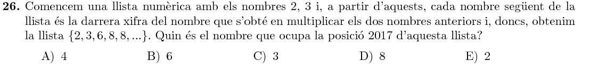

Vegem com continua la llista, fins trobar un patró:
$$
2,3,\underbrace{6,8,8,4,2,8},\underbrace{6,8,8,4,2,8},\ldots
$$
Buscarem la posició $2015$ a partir de la posició $3$, en què es comença a repetir una seqüència de longitud $6$.  Calculem el residu de la divició per $6$:
$$
2015=335\cdot6+5
$$
Per tant, a la posició $2017$ hi ha el $5\text{è}$ nombre del cicle: un $2$.

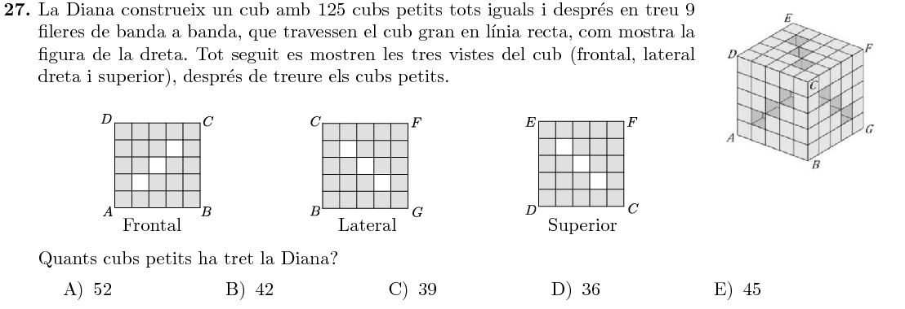

Comencem comptant els $3$ cubets que ha tret de la superfície de cada cara. En total això són $6\cdot3=18$ cubets.

Pel que fa al cub $3\times3\times3$ interior, mirem en detall què passa a cada capa, per no descomptar-nos:

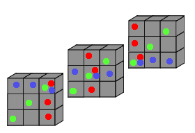

Al cub interior Diana ha tret $7\cdot3=21$ cubets.

En total, ha tret
$$
18+21=39\text{ cubets}
$$
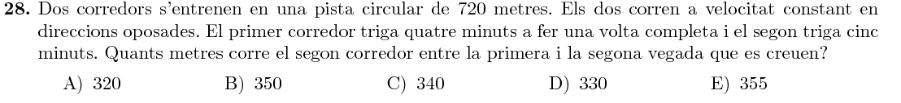

Els corredors van a una velocitat de:
$$
v_A=\frac{720}{4}=180\text{ m/min}
$$

$$
v_B=\frac{720}{5}=144\text{ m/min}
$$

Tornaran a coincidir després de $t$ minuts, en què entre els dos hauran recorregut $720\text{ m}$:
$$
180t+144t=720\quad\Rightarrow\quad324t=720\quad\Rightarrow\quad t=\frac{20}{9}
$$
En aquest temps, el segon corredor haurà recorregut:
$$
d_B=144\cdot\frac{20}{9}=320\text{ m}
$$
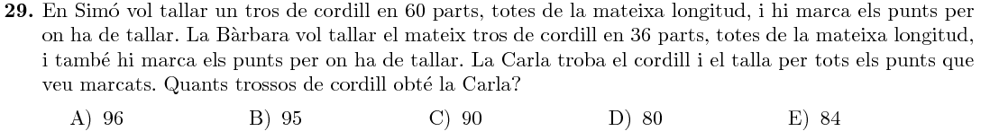

Els punts que marca en Simó són:
$$
\frac{1}{60},\ \frac{2}{60},\ \frac{3}{60},\ \cdots,  \frac{59}{60}
$$
I els que marca Bàrbara són:
$$
\frac{1}{36},\ \frac{2}{36},\ \frac{3}{36},\ \cdots,  \frac{35}{36}
$$
Recordem també les factoritzacions en nombres primers de $36$ i $60$:
$$
36=2^2\cdot3^2
$$

$$
60=2^2\cdot3\cdot5
$$

Per tal que dues fraccions (una de cada llista) siguen iguals, les primeres han d'eliminar el factor $5$ del denominador (tenint un $5$ al numerador), i les segones han d'eliminar un $3$ del denominador (tenint un $3$ al numerador).

Entre l'$1$ i el $59$, hi ha $11$ múltiples de $5$, i entre l'$1$ i el $35$ hi ha $11$ múltiples de $3$, que ens donaran les $11$ coincidències ens les marques:

$$
\begin{array}{ccccc}
\text{Simó}&&&&\text{Bàrbara}\\
\frac{5}{60}&=&\frac1{12}&=&\frac{3}{36}\\
\frac{10}{60}&=&\frac2{12}&=&\frac{6}{36}\\
\cdots&&\cdots&&\cdots\\
\frac{55}{60}&=&\frac{11}{12}&=&\frac{33}{36}
\end{array}
$$

En total, doncs, hi haurà:

$$
\text{marques}=59+35-11=83
$$

La qual cosa suposa que el cordill es tallarà en:

$$
\text{trossos}=83+1=84
$$

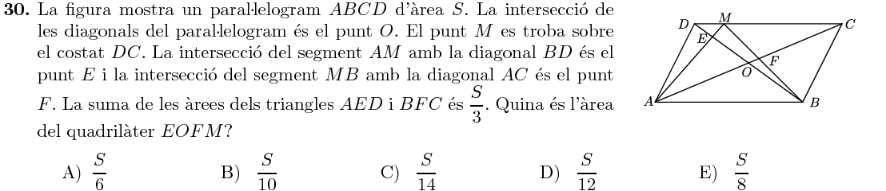

