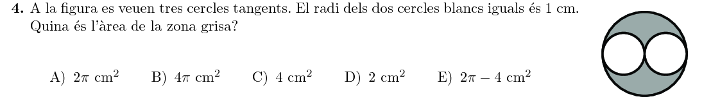
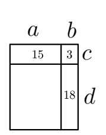
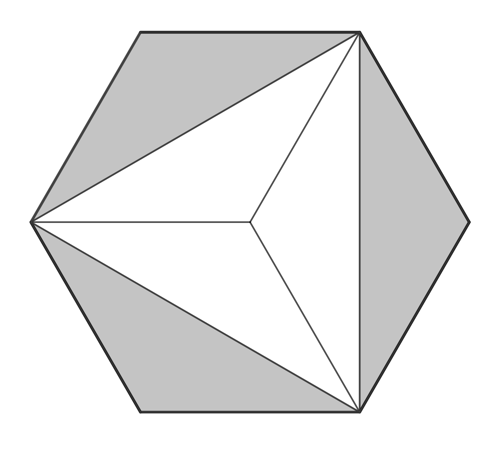
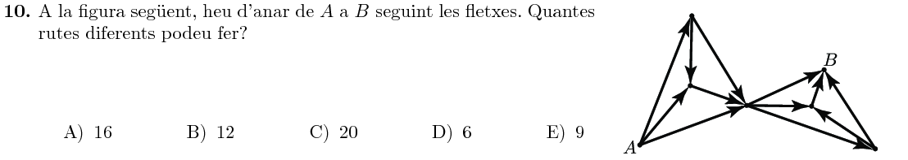
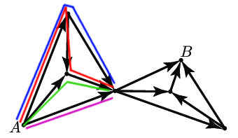
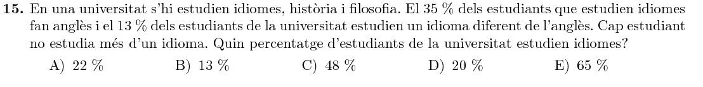
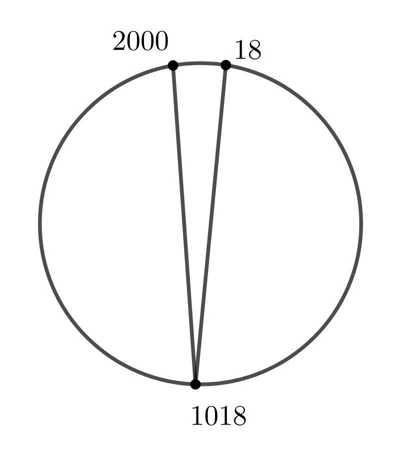

Title: Solucions del Cangur 2018 a Catalunya: 1r de batxillerat
Date: 2018-7-26 12:00
Amagarportada: True
Tags: cangur, matemàtiques
Category: cangur
Keywords: 2018
Extra: katex
Slug: solucions-cangur-2018-catalunya-1r-batx
Description: Recull de solucions del nivell de 1r de batxillerat de les Proves Cangur 2018 a Catalunya

Aquest és el recull de solucions del Nivell de 1r de batxillerat del Cangur de Catalunya de 2018. Els enunciats estan extrets del primer model d'examen del [pdf d'enunciats]({filename}enunciat_2018_cat_1r_batx.pdf){:target="_blank"}. Les solucions estan amagades (cal fer clic per mostrar-les) perquè és recomanable pensar detingudament cada problema abans de mirar la solució que jo proposo!

Podeu accedir a les qüestions directament:

* Qüestions de 3 punts: [1](#questio-1), [2](#questio-2), [3](#questio-3), [4](#questio-4), [5](#questio-5), [6](#questio-6), [7](#questio-7), [8](#questio-8), [9](#questio-9), [10](#questio-10).
* Qüestions de 4 punts: [11](#questio-11), [12](#questio-12), [13](#questio-13), [14](#questio-14), [15](#questio-15), [16](#questio-16), [17](#questio-17), [18](#questio-18), [19](#questio-19), [20](#questio-20).
* Qüestions de 5 punts: [21](#questio-21), [22](#questio-22), [23](#questio-23), [24](#questio-24), [25](#questio-25), [26](#questio-26), [27](#questio-27), [28](#questio-28), [29](#questio-29), [30](#questio-30).

Els enunciats del Cangur són propietat de la Societat Catalana de Matemàtiques i *Le Kangourou sans Frontières*.

### Qüestions de 3 punts

Calculem el valor de l'operació:

$$\frac{20}{17}-\frac{20}{18}-\frac{2020}{1717}+\frac{2020}{1818}=\frac{20}{17}-\frac{20}{18}-\frac{11\cdot20}{11\cdot17}+\frac{11\cdot20}{11\cdot18}=$$
$$=\frac{20}{17}-\frac{20}{18}-\frac{20}{17}+\frac{20}{18}=\boxed0$$

Com a mínim hi han d'haver dues noies, per tal que cadascuna d'elles vegi l'altra. També cal que hi hagin tres nois, per tal que cadascun d'ells en vegi dos.

En total, com a mínim hi ha $2+3=\boxed5$ persones al grup.

El tercer costat ha de ser major que $3$ (perquè si no, aquest costat amb el costat de mida $2$ no abarcarien el costat de longitud $5$).

De la mateixa manera, el costat ha de ser més petit que $7$, ja que si no, els costats $2$ i $5$ no arribarien a aquesta longitud.

Per tant, el tercer costat ha de tenir mida $\boxed5$.

El radi dels cercles blancs és $1$, i per tant la seva àrea és:

$$A_\text{cercle petit}=\pi1^2=\pi$$

El radi del cercle gran és $2$, i per tant la seva àrea és:

$$A_\text{cercle gran}=\pi2^2=4\pi$$

Per tant, l'àrea grisa és:

$$A_\text{grisa}=4\pi-2\pi=\boxed{2\pi\text{ cm}^2}$$

Anomenem $a,b,c,d$ els quatre segments de la figura següents:

Volem esbrinar el valodr de $ad$, i per l'enunciat, sabem que:
$$ac=15,\quad bc=3,\quad bd=18$$
Però llavors:
$$bd=18\quad\Rightarrow\quad b=\frac{18}d$$
$$bc=3\quad\Rightarrow\quad c=\frac3b=\frac3{\frac{18}d}=\frac{d}6$$
$$ac=a\cdot\frac{d}6=15\quad\Rightarrow\quad ad=6\cdot15=\boxed{90}$$

Anomenem $a, m, t$ les alçàries d'Aina, Miquel i la taula.
Les dues situacions de l'enunciat es corresponen amb les següents equacions:

$$\begin{cases}
t+a=m+80\\
t+m=a+100
\end{cases}$$

Si sumem les dues equacions tenim:

$$2t+a+m=m+a+180\quad\Rightarrow\quad 2t=180\quad\Rightarrow\quad t=\boxed{90\text{ cm}}$$

Si el nombre del mig és $x$, llavors la suma de $x-2,x-1,x,x+1,x+2$ és $5x$. Per tant, $x$ és:

$$5x=10^{2018}\quad\Rightarrow\quad x=\frac{10^{2018}}5=\frac{2\cdot5\cdot10^{2017}}5=\boxed{2\cdot10^{2017}}$$

És evident que la figura $Y$ té la meitat de l'àrea ombrejada.
La següent figura ens ajuda a veure que $X$ i $Z$ també tenen la meitat de l'àrea ombrejada:

Per tant, hem comprovat que $\boxed{X=Y=Z}$.

Fem el càlcul:

$$\frac{25}{100}\cdot2018+\frac{2018}{100}\cdot25=\frac{25\cdot2018+25\cdot2018}{100}=\frac{2\cdot25\cdot2018}{2\cdot2\cdot25}=\frac{2018}2=\boxed{1009}$$

Per arribar al punt del mig, hi ha $4$ camins diferents:

Si ens fixem, des del punt del mig fins al punt $B$, els camins també són $4$, ja que el graf és equivalent.

Per tant, en total hi ha $4\cdot4=\boxed{16}$ camins possibles.

### Qüestions de 4 punts

El producte serà zero si alguna de les xifres és zero.

Comptem quants nombres de $4$ xifres no tenen cap zero. Cada dígit pot ser qualsevol entre l'$1$ i el $9$, per tant, hi ha $9$ opcions per cada dígit. En total, hi ha $9^4=6561$ nombres que no tenen cap zero.

Per tant, els nombres que tenen algun zero són:

$$9000-6561=\boxed{2439}$$

Si apareixen els $n$ primers nombres a la successió, cadascun $n$ cops, a la successió hi ha $\frac{n\cdot(n+1)}2$ elements. Per tant, $n$ és:

$$\frac{n\cdot(n+1)}2=105\quad\Rightarrow\quad n^2+n-210=0$$

Resolent l'equació de segon grau, tenim que:

$$n=\frac{-1\pm \sqrt{1+840}}{2}=\frac{-1\pm29}{2}=14$$

Per tant, els nombres divisibles per $3$ són $3,6,9,12$, que apareixen $3,6,9,12$ cops, en total:

$$3+6+9+12=\boxed{30}$$

Una possible solució és que tots els trens anessin a $Q$, amb $10$ d'ells sortint de cadascuna de les altres ciutats. Per tant, la solució ha de ser $\boxed{40}$.

El $13\%$ dels estudiants de la universitat fan un idioma diferent de l'anglès, i representen un $65\%$
de tots els estudiants d'idiomes (perquè el $35\%$ fan anglès).
Així doncs, el nombre total d'estudiants d'idiomes és:

$$P_\text{idiomes}=\frac{13}{0.65}=\boxed{20\%}$$

Anomenem $p,g$ els diners que li van donar el pare i la germana major. Per l'enunciat sabem que:

$$p=\frac{g+10}2$$
$$g=\frac{p+10}3$$

Substituïm la $p$ a la segona equació:

$$g=\frac{\frac{g+10}2+10}3=\frac{\frac{g+10+20}{2}}{3}=\frac{g+30}{6}\quad\Rightarrow\quad 6g=g+30\quad\Rightarrow\quad g=6$$

Per tant, $p$ és:

$$p=\frac{6+10}2=8$$

I el llibre val:

$$8+6+10=24\text{ €}$$

Si el nombre és $abc$, és a dir, $100a+10b+c$, llavors la propietat de l'enunciat és:

$$10a+c=\frac{100a+10b+c}9\quad\Rightarrow\quad 90a+9c=100a+10b+c\quad\Rightarrow$$
$$\Rightarrow\quad 10a+10b-8c=0$$

Primer de tot, vegem en una figura el polígon i les dues diagonals:

Hi ha $3$ polígons:

* Entre el vèrtex $18$ i el $1018$, amb $1018-18+1=1001$ vèrtexs.
* Entre el vèrtex $1018$ i el $2000$, amb $2000-1018+1=983$ vèrtexs.
* Entre el vèrtex $2000$ i el $18$, amb $2018-2000+1+18+1=38$ vèrtexs.

Podem comprovar que la suma de vèrtexs coincideix amb els $2018$ vèrtexs del polígon original més $4$:

$$1001+983+37=2021=2018+4$$

Això és correcte perquè el vèrtex $2000$ apareix a $2$ polígons, el $18$ a $2$ polígons, i el $1018$ a $3$ polígons. Per tant, hem comptat $7$ cops aquests tres vèrtexs, $4$ cops més dels que apareixien en el polígon original.

Així, els vèrtexs dels tres polígons són:

$$\boxed{38, 983, 1001}$$

### Qüestions de 5 punts

Si els nombres són $a,b,c,d$, l'enunciat ens diu que:

$$\frac{b+c+d}3+a=17$$
$$\frac{a+c+d}3+b=21$$
$$\frac{a+b+d}3+c=23$$
$$\frac{a+b+c}3+d=29$$

Multipliquem totes les equacions per $3$:

$$3a+b+c+d=3\cdot17$$
$$a+3b+c+d=3\cdot21$$
$$a+b+3c+d=3\cdot23$$
$$a+b+c+3d=3\cdot29$$

És evident que el nombre més gran serà $d$, ja que en multiplicar $d$ per $3$ és quan obtenim una major suma.

Sumem ara les equacions multiplicant-les:

$$-1\times(3a+b+c+d=3\cdot17)$$
$$-1\times(a+3b+c+d=3\cdot21)$$
$$-1\times(a+b+3c+d=3\cdot23)$$
$$5\times(a+b+c+3d=3\cdot29)$$

Les $a,b,c$ s'sanul·len, i obtenim:

$$12d=-3\cdot17-3\cdot21-3\cdot23+5\cdot3\cdot29\quad\Rightarrow$$
$$\Rightarrow\quad4d=-17-21-23+5\cdot29=84\quad\Rightarrow$$
$$d=21$$

Per tant, el nombre més gran dels quatre és $\boxed{21}$.

Comencem situant el punt $A_0$ a l'origen de la recta, és a dir, al punt $0$, i el punt $A_1$, que està a $1$ de distància:

$$A_0=0$$
$$A_1=1$$

Si el punt $A_n$ és el punt mig del segment $A_{n+1}A_{n+2}$, llavors:

$$A_n = \frac{A_{n+1}+A_{n+2}}2$$

Per tant:

$$A_{n+2} = 2A_{n}-A_{n+1}$$

Ja tenim doncs la fórmula per obtenir els següents valors de la seqüència. Anem calculant-los:

$$\begin{array}{ccc}
\text{Punt} & \text{Càlcul} & \text{Valor} \\
A_0 && 0 \\
A_1 && 1 \\
A_2 & 2\cdot0-1 & -1 \\
A_3 & 2\cdot1-(-1) & 3 \\
A_4 & 2\cdot(-1)-3 & -5 \\
A_5 & 2\cdot3-(-5) & 11 \\
A_6 & 2\cdot(-5)-11 & -21 \\
A_7 & 2\cdot(11)-(-21) & 43 \\
A_8 & 2\cdot(-21)-43 & -85 \\
A_9 & 2\cdot43-(-85) & 171 \\
A_{10} & 2\cdot(-85)-171 & -341 \\
A_{11} & 2\cdot171-(-341) & 683 \\
\end{array}$$

I la solució és:

$$A_{11}=\boxed{683}$$

Com que $2018=2\cdot1009$, només hi ha dues formes de formar un rectangle amb $2018$ quadrats: o bé $1\times2018$, o bé $2\times1009$.

$$\begin{array}{|c|c|c|c|c|c|c|c|c|}
\hline
\blacksquare&3&\blacksquare&3&\blacksquare&\cdots&\blacksquare&3&\blacksquare\\ \hline
2&\blacksquare&3&\blacksquare&3&\cdots&3&\blacksquare&2\\ \hline
\end{array}$$

Com el rectangle té longitud $1009$, i hi ha ha un nombre a cada columna, en total hi ha $1007$ tresos i $2$ dosos, i sumen:

$$3\cdot1007+2\cdot2=\boxed{3025}$$

Posem les fitxes en ordre, una per cada columna.
La fitxa de la primera columna pot anar a qualsevol de les $6$ files.
La fitxa de la segona columna pot anar a una de $5$ files, ja que no pot coincidir amb l'anterior.
La tercera fitxa té $4$ files per escollir.

En total, hi ha:

$$6\cdot5\cdot4=\boxed{120}\text{ maneres}$$

