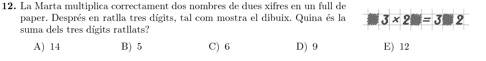
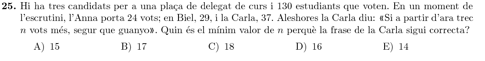

Title: Solucions del Cangur 2018 a Catalunya: 3r d'ESO
Date: 2018-7-26 12:00
Amagarportada: True
Tags: cangur, matemàtiques
Category: cangur
Keywords: 2018
Extra: katex
Slug: solucions-cangur-2018-catalunya-3r-eso
Description: Recull de solucions del nivell de 3r d'ESO de les Proves Cangur 2018 a Catalunya

Aquest és el recull de solucions del Nivell de 3r d'ESO del Cangur de Catalunya de 2018. Els enunciats estan extrets del primer model d'examen del [pdf d'enunciats]({filename}enunciat_2018_cat_3r_eso.pdf){:target="_blank"}. Les solucions estan amagades (cal fer clic per mostrar-les) perquè és recomanable pensar detingudament cada problema abans de mirar la solució que jo proposo!

Podeu accedir a les qüestions directament:

* Qüestions de 3 punts: [1](#questio-1), [2](#questio-2), [3](#questio-3), [4](#questio-4), [5](#questio-5), [6](#questio-6), [7](#questio-7), [8](#questio-8), [9](#questio-9), [10](#questio-10).
* Qüestions de 4 punts: [11](#questio-11), [12](#questio-12), [13](#questio-13), [14](#questio-14), [15](#questio-15), [16](#questio-16), [17](#questio-17), [18](#questio-18), [19](#questio-19), [20](#questio-20).
* Qüestions de 5 punts: [21](#questio-21), [22](#questio-22), [23](#questio-23), [24](#questio-24), [25](#questio-25), [26](#questio-26), [27](#questio-27), [28](#questio-28), [29](#questio-29), [30](#questio-30).

Els enunciats del Cangur són propietat de la Societat Catalana de Matemàtiques i *Le Kangourou sans Frontières*.

### Qüestions de 3 punts

Totes les lletres de la paraula VOTO tenen un eix de simetria vertical, i per tant aquesta
és la solució.

El perímetre del triangle és $6+10+11=27$. Un triangle equilàter amb aquest perímetre
té un costat de $\frac{27}3=9$.

Simplifiquem la fracció:

$$\frac{2018+2018}{2018+2018+2018}=\frac{2\cdot2018}{3\cdot2018}=\frac23$$

Podem aïllar el triangle i simplificar fàcilment:

$$\triangle=\frac{2\times18\times14}{6\times7}=2\times\frac{18}6\times\frac{14}7=2\times3\times2=12$$

Podem descartar els dibuixos $A$ i $B$ perquè tenen els cercles massa a prop de la base de la tanca.
Pel que fa a la resta, l'opció $C$ és la que té els triangles ben orientats.

Com que $2018\times14$ és múltiple de $7$, el residu d'aquest sumand és zero.
Per tant, el residu de la suma serà el residu de dividir $15$ per $7$, que 
és $1$.

En el pitjor dels casos, hi haurà un terç de persones a qui no agrada el futbol, però sí el tennis.

Per tant, dels $\frac34$ aficionats del tennis, també els agrada el futbol a:
$$\frac34-\frac13=\frac9{12}-\frac4{12}=\frac5{12}$$

Hi ha $4$ camins possibles:

Per la figura sabem que $5$ costats petits es corresponen amb $2$ costats llargs.
Per tant, el costat curt mesura:

$$\text{costat curt}=\frac25\times10=4$$

El perímetre del rectangle gran està format per $6$ costats llargs i $4$ de curts, és a dir:

$$\text{P}=6\times10+4\times4=76$$

Els cercles tenen diàmetre $7$, i per tant, radi $3.5$.
Cadascun dels centres està a $3.5$ dels extrems dret i esquerre del rectangle, i per tant
estan a una distància entre ells de:

$$D=11-3.5-3.5=4$$

### Qüestions de 4 punts

El quadrat té àrea $3\times3=9$, i el triangle $\triangle DMC$ té una àrea que 
és un terç d'aquesta àrea, és a dir, $3$.

Com l'altura del triangle $\triangle DMC$ és $3$, amb la base $DM$, la fórmula de la
seua àrea és:

$$A_{\triangle DMC}=\frac12\times \overline{DM}\times3=3$$

I si aïllem $DM$ tenim:

$$\overline{DM}=2$$

Provant una mica és fàcil adonar-se que la multiplicació ha de ser:

$$13\times24=312$$

Per tant la suma dels tres dígits és:

$$S=1+4+1=6$$

En primer lloc, intentem esbrinar la mida del rectangle. Anomenem $a,b$ els dos
costats del triangle (el nombre de files i columnes de quadradets).

Sabem que $a\times b=40$, i que $a,b>1$.
Per poder parlar d'una fila del mig, cal que $a$ sigui senar, i per tant $b$ ha de ser parell.

La descomposició en factors primers de $40$ és $40=2^3\times5$.
Per tant, necessàriament el nombre de files i columnes serà: $a=5$, $b=8$.

La fila del mig té $8$ quadrats, i sense pintar en queden $40-8=32$.

Si el regal fos a la caixa $1$, llavors les dues primeres pistes serien certes, cosa que no pot ser.

Si el regal fos a la caixa $2$, cap de les tres pistes seria certa, però sabem que una ho ha de ser.

Per tant, el regal és a la caixa $3$.

Començant per dalt, i partint d'una recta horitzontal, realitzem un gir negatiu de $-10^\circ$ i després un positiu de $14^\circ$,
obtenint una recta amb $4^\circ$ positius.

Per baix, l'operació que hem de fer és $26-33=-7^\circ$.

Entre ambdues rectes formen un angle de:

$$\alpha=4-(-7)=11^\circ$$

Anomenem $x,y$ els dos primers nombres de la seqüència:

$$x\quad y\quad 1\quad\_\quad\_\quad\_\quad\_\quad32$$

Si emplenem els buits amb el producte dels dos nombres anteriors tenim:

$$x\quad y\quad (x\cdot y=1)\quad y\quad y\quad y^2\quad y^3\quad (y^5=32)$$

Però resulta que $32=2^5$, i per tant $y=2$. Llavors:

$$x\cdot y=1 \quad\Rightarrow\quad 2x=1 \quad\Rightarrow\quad x=\frac12$$

L'any $2018$ té $365$ dies, per tant aquesta illa tindrà 15 dies núvol.

En el pitjor dels casos, el primer dia de la Carla a l'hotel farà sol, però el dia
següent estarà núvol, cosa que es repetirà durant $30$ dies en total.

Llavors, necessàriament tindrà dos dies de sol seguits. En total, haurà hagut d'esperar $32$ dies.

Si la Carme ha gastat $c$, llavors la Berta ha gastat $0.15c$ i l'Àlia $1.6c$.
En total, les tres han gastat:

$$1.6c+0.15c+x=2.75c=55$$

Podem aïllar la $c$ i esbrinem que la Carme va gastar:

$$c=\frac{55}{2.75}=20$$

Per tant, Àlia va gastar:

$$a=1.6c=32$$

L'àrea d'un triangle és la meitat de la base per l'altura.
En el nostre cas, els dos triangles tenen la mateixa base (el costat llarg del triangle).
A més, les sumes de les seves altures és també l'altura del rectangle.

En conclusió, la suma de les àrees dels dos triangles és la meitat de l'àrea del rectangle, és a dir, $20\text{ cm}^2$.

Si sumem les tres files i les tres columnes, sumem cada nombre dos cops. En total, sumarem:

$$S=2\cdot(1+2+\cdots+8+9)=2\cdot45=90$$

La suma dels cinc resultats que sabem són:

$$12+13+15+16+17=73$$

I per tant el sisè resultats serà: $90-73=17$.

### Qüestions de 5 punts

Anomenem $x_1,x_2,\ldots,x_{11}$ els punts, ordenats d'esquerra a dreta. Llavors, les sumes són:

$$2018=(x_2-x_1)+(x_3-x_1)+\cdots+(x_{11}-x_1)=-10x_1+(x_2+x_3+\cdots+x_{11})$$
$$2000=(x_2-x_1)+(x_3-x_2)+\cdots+(x_{11}-x_2)=-x_1-9x_2+(x_2+x_3+\cdots+x_{11})$$

Si restem les dues equacions, obtenim:

$$18=-9x_1+9x_2=9(x_2-x_1)$$

I per tant, la distància entre els dos primers punts és:

$$x_2-x_1=\frac{18}{9}=2$$

Considerem $4$ nombres consecutius qualsevols en aquest requadre: $a,b,c,d$.
Com cada número és la suma dels dos que són a la vora, resulta que:

$$b = a + c$$
$$c = b + d$$

Si aïllem $c$ a la primera equació, tenim que $c=b-a$, i substituint a la segona:

$$b-a=b+d \quad\Rightarrow\quad -a=d$$

El que hem deduit, és que cada $3$ elements en aquesta seqüència, obtenim el nombre original amb el signe canviat.
Si anem omplint a partir del $10$ i el $3$, obtenim:

I per tant, $x=-3+10=7.$

La Isabel ha fet $6$ llargs de piscina, és a dir, $300\text{ m}$.
Com en Simó corre $3$ cops més ràpid, en el mateix temps ha corregut $900\text{ m}$.
Com sabem que ha fet $5$ voltes, una volta a la piscina mesura: $\frac{900}5=180\text{ m}$.
Finalment, una volta a la piscina és la suma dels $4$ costats.
Si anomenem $x$ el costat que no coneixem:

$$180=2\times50 + 2\times c\quad\Rightarrow\quad c=\frac{180-100}2=40$$

Dels $130$ vots, comptem primer quants queden per contar:

$$\text{queden}=130-(24+29+37)=40$$

En el pitjor dels casos, en Biel rebria $8$ vots més, i llavors estarien empatats a $37$ i quedarien $32$ vots per contar.

Per tant, la Carla necessitaria més de la meitat d'aquests $32$ vots, és a dir, un total de $17$.

Podem dividir l'hexàgon en $6$ triangles equilàters formats pel centre i cadascun dels costats. Aquests triangles tenen un costat que és $\frac{DE}2$, i una àrea de $\frac16$.

Per tant, el triangle gran, que té un costat que és $3DE$, té un costat $6$ vegades més llarg que el dels triangles petits. Com ambdos són triangles equilàters, i per tant semblants, l'àrea del gran serà $6^2=36$ vegades major, és a dir:

$$A=36\cdot \frac16=6$$

Suposem que ha fet $n$ salts quan porta una mitjana de $3.80$. Després de saltar $3.99$, la mitjana ha augmentat en $1$ cm:

$$3.81=\frac{3.80n+3.99}{n+1}\quad\Rightarrow\quad 3.81n+3.81=3.80n+3.99\quad\Rightarrow$$
$$\Rightarrow\quad 0.01n=0.18 \quad\Rightarrow\quad n=18$$

Per tal que la mitjana augmenti un altre centímetre, necessitem que:

$$3.82=\frac{3.81\cdot19+x}{20}\quad\Rightarrow\quad 3.82\cdot20=3.81\cdot19+x\quad\Rightarrow$$
$$\Rightarrow\quad 76.40 = 72.39 \quad\Rightarrow\quad x=4.01$$

Així, el pròxim salt ha de ser de $4.01\text{ m}$.

