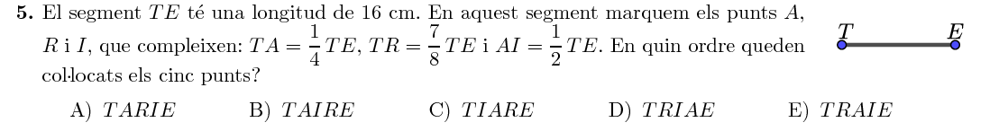
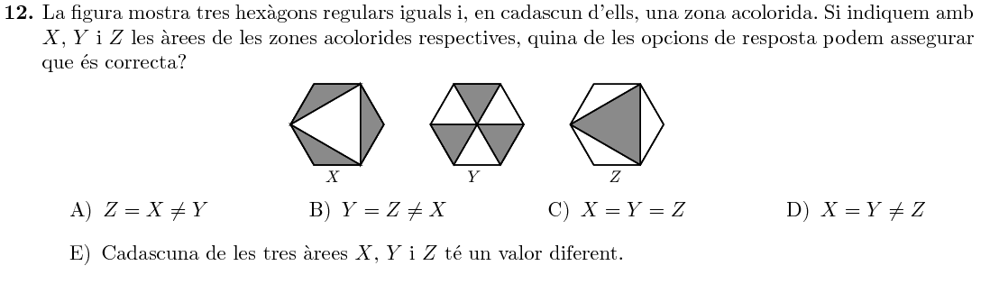
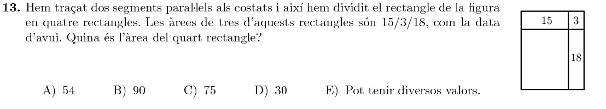
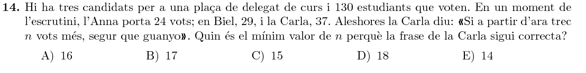
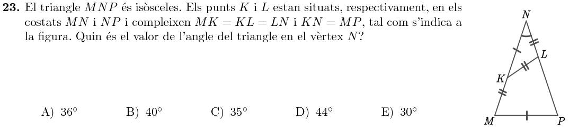

Title: Solucions del Cangur 2018 a Catalunya: 4t d'ESO
Date: 2018-7-26 12:00
Amagarportada: True
Tags: cangur, matemàtiques
Category: cangur
Keywords: 2018
Extra: katex
Slug: solucions-cangur-2018-catalunya-4t-eso
Description: Recull de solucions del nivell de 4t d'ESO de les Proves Cangur 2018 a Catalunya

Aquest és el recull de solucions del Nivell de 4t d'ESO del Cangur de Catalunya de 2018. Els enunciats estan extrets del primer model d'examen del [pdf d'enunciats]({filename}enunciat_2018_cat_4t_eso.pdf){:target="_blank"}. Les solucions estan amagades (cal fer clic per mostrar-les) perquè és recomanable pensar detingudament cada problema abans de mirar la solució que jo proposo!

Podeu accedir a les qüestions directament:

* Qüestions de 3 punts: [1](#questio-1), [2](#questio-2), [3](#questio-3), [4](#questio-4), [5](#questio-5), [6](#questio-6), [7](#questio-7), [8](#questio-8), [9](#questio-9), [10](#questio-10).
* Qüestions de 4 punts: [11](#questio-11), [12](#questio-12), [13](#questio-13), [14](#questio-14), [15](#questio-15), [16](#questio-16), [17](#questio-17), [18](#questio-18), [19](#questio-19), [20](#questio-20).
* Qüestions de 5 punts: [21](#questio-21), [22](#questio-22), [23](#questio-23), [24](#questio-24), [25](#questio-25), [26](#questio-26), [27](#questio-27), [28](#questio-28), [29](#questio-29), [30](#questio-30).

Els enunciats del Cangur són propietat de la Societat Catalana de Matemàtiques i *Le Kangourou sans Frontières*.

### Qüestions de 3 punts

### Qüestions de 4 punts

### Qüestions de 5 punts

